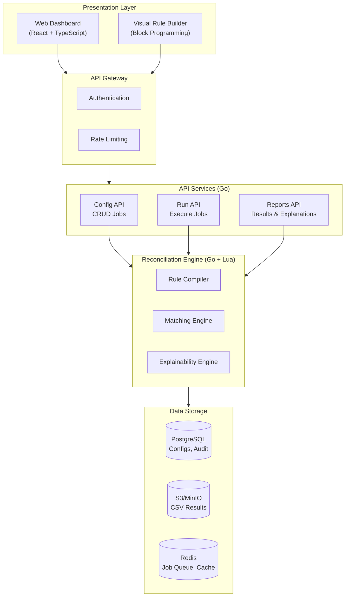

# Reconciliation Engine - System Design Overview

## 1. Introduction

A cloud-native reconciliation engine for financial transaction matching with:
- Visual rule builder for non-technical users
- High-performance matching (1M+ records/second)
- Full explainability and audit trail
- Multi-stage workflow support

## 2. Requirements Summary

| Category | Requirement |
|----------|-------------|
| **Matching Modes** | 1:1 (MVP), 1:N, N:M (future) |
| **Rule Types** | Comparison, Boolean (AND/OR/NOT), Tolerance, Date functions |
| **Explainability** | Human-readable audit trail for every match decision |
| **Multi-Stage** | DAG-based workflow with stage dependencies |
| **Performance** | 1M x 1M records in < 1 second |
| **Data Sources** | PostgreSQL, REST API, SFTP, CSV |
| **Deployment** | Kubernetes (cloud-native) |
| **Users** | Non-technical (visual builder required) |

## 3. High-Level Architecture

## 4. Component Overview

### 4.1 Presentation Layer
- **Web Dashboard**: React + TypeScript application for job management, monitoring, and reports
- **Visual Rule Builder**: Block-based programming interface for non-technical users to define matching rules

### 4.2 API Layer
- **Config API**: CRUD operations for reconciliation jobs
- **Run API**: Job execution triggers and status monitoring
- **Reports API**: Results retrieval and match explanations

### 4.3 Engine Core
- **Rule Compiler**: Transforms Block JSON (visual builder output) to executable Lua code
- **Matching Engine**: Hash Join algorithm for high-performance record matching
- **Explainability Engine**: Generates human-readable explanations for every match decision

### 4.4 Storage Layer
- **PostgreSQL**: Job configurations, audit logs, match explanations
- **S3/MinIO**: Large result files (CSV exports)
- **Redis**: Job queue, compiled rule cache, rate limiting

## 5. Technology Stack

| Component | Technology | Rationale |
|-----------|------------|-----------|
| **Core Engine** | Go 1.21+ | Fast, single binary, K8s-native |
| **Rule Runtime** | gopher-lua | Embeddable Lua, sandboxed |
| **API Framework** | Gin / Echo | High-performance HTTP |
| **Web Dashboard** | React + TypeScript | Component-based, typed |
| **Visual Builder** | React + Custom | Block programming UI |
| **Database** | PostgreSQL 15+ | JSONB, ACID, mature |
| **Object Storage** | MinIO / S3 | S3-compatible, CSV storage |
| **Job Queue** | Redis + Asynq | Simple, Go-native |
| **Caching** | Redis | Config cache, rate limiting |
| **Monitoring** | Prometheus + Grafana | K8s-native observability |
| **Logging** | Loki + Promtail | Log aggregation |
| **Tracing** | Jaeger / Tempo | Distributed tracing |

## 6. Document Index

| Document | Description |
|----------|-------------|
| [01-matching-engine.md](./01-matching-engine.md) | Matching algorithms and engine architecture |
| [02-rule-expression-system.md](./02-rule-expression-system.md) | Block types, JSON schema, Lua compilation |
| [03-explainability.md](./03-explainability.md) | Match explanation system |
| [04-multi-stage-workflows.md](./04-multi-stage-workflows.md) | DAG-based multi-stage reconciliation |
| [05-api-contracts.md](./05-api-contracts.md) | REST API endpoints and contracts |
| [06-database-schema.md](./06-database-schema.md) | PostgreSQL schema and indexes |
| [07-deployment.md](./07-deployment.md) | Kubernetes deployment architecture |
| [08-security.md](./08-security.md) | Security considerations and Lua sandbox |
