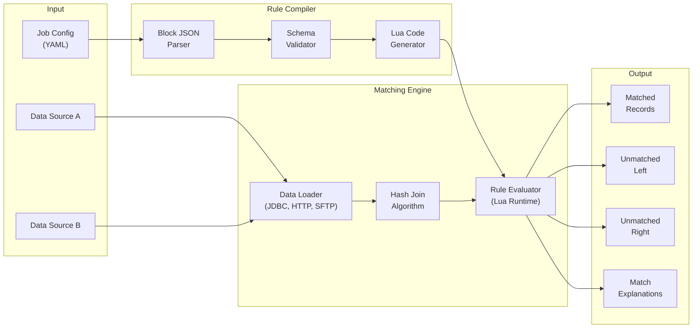
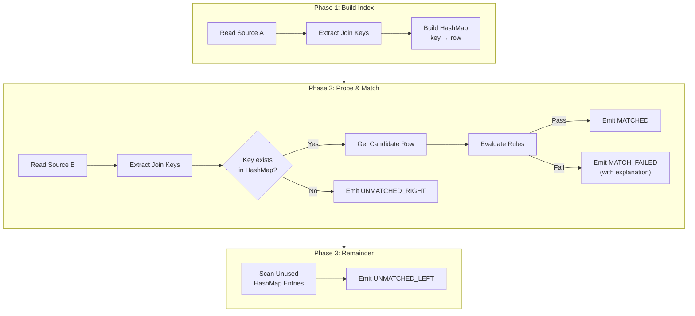
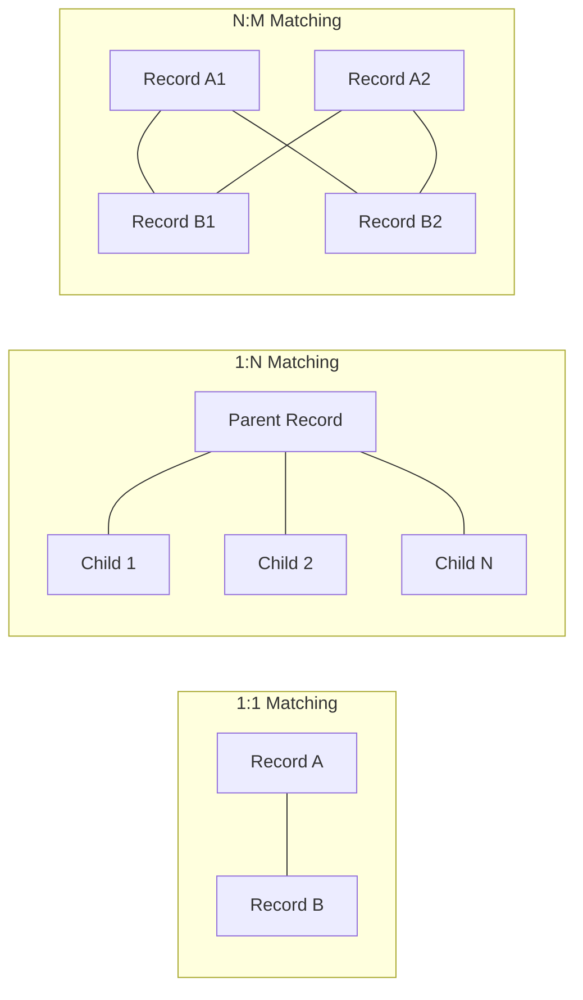
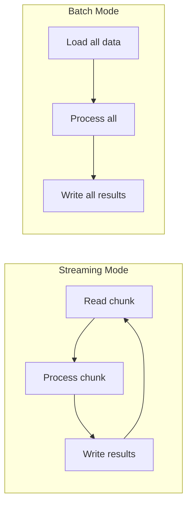

# Matching Engine

## 1. Overview

The matching engine is the core component responsible for comparing records from two data sources and determining matches based on configured rules.

## 2. Engine Architecture



## 3. Hash Join Algorithm (1:1 Matching)

The Hash Join algorithm provides O(n + m) time complexity for matching, making it ideal for large datasets.



### 3.1 Phase Details

#### Phase 1: Build Index
1. Stream records from Source A (typically the smaller dataset)
2. Extract join key fields (e.g., `transaction_id`, `reference_number`)
3. Build in-memory hash map: `key → record`
4. Mark all entries as "unused"

#### Phase 2: Probe & Match
1. Stream records from Source B
2. Extract join key fields
3. Probe the hash map:
   - **Key Found**: Get candidate record, evaluate matching rules
     - Rules pass → Emit MATCHED, mark entry as "used"
     - Rules fail → Emit MATCH_FAILED with explanation
   - **Key Not Found**: Emit UNMATCHED_RIGHT

#### Phase 3: Remainder
1. Scan hash map for entries still marked "unused"
2. Emit UNMATCHED_LEFT for each

### 3.2 Complexity Analysis

| Operation | Time Complexity | Space Complexity |
|-----------|-----------------|------------------|
| Build Index | O(n) | O(n) |
| Probe & Match | O(m) | O(1) per record |
| Remainder | O(n) | O(1) |
| **Total** | **O(n + m)** | **O(n)** |

Where n = Source A records, m = Source B records.

## 4. Matching Modes



### 4.1 One-to-One (1:1)
- **MVP Implementation**
- Each record from Source A matches at most one record from Source B
- First match wins (deterministic)
- Use case: Transaction matching where IDs are unique

### 4.2 One-to-Many (1:N)
- **Future Implementation**
- One parent record matches multiple child records
- Aggregation rules: sum of children must equal parent amount
- Use case: Invoice vs line items, batch transactions

### 4.3 Many-to-Many (N:M)
- **Future Implementation**
- Multiple records from both sources can match
- Complex reconciliation scenarios
- Use case: Split transactions, partial settlements

## 5. Join Key Strategy

### 5.1 Simple Key
Single field as join key:
```yaml
joinConditions:
  - leftField: transaction_id
    rightField: txn_id
```

### 5.2 Composite Key
Multiple fields combined:
```yaml
joinConditions:
  - leftField: account_number
    rightField: acct_num
  - leftField: transaction_date
    rightField: txn_date
```

### 5.3 Fuzzy Key (Future)
Approximate matching with tolerance:
```yaml
joinConditions:
  - leftField: amount
    rightField: amount
    tolerance: 0.01
    toleranceType: absolute  # or percentage
```

## 6. Data Loading

### 6.1 Supported Data Sources

| Type | Protocol | Configuration |
|------|----------|---------------|
| **PostgreSQL** | JDBC | Connection string, query |
| **REST API** | HTTP/HTTPS | URL, headers, pagination |
| **SFTP** | SSH | Host, credentials, path |
| **CSV** | File | Path, delimiter, encoding |
| **S3** | HTTP/HTTPS | Bucket, key, credentials |

### 6.2 Streaming vs Batch



- **Streaming**: For large datasets, memory-efficient
- **Batch**: For smaller datasets, simpler implementation

## 7. Performance Optimizations

### 7.1 Parallelization
- Partition Source B by key hash
- Process partitions in parallel
- Merge results

### 7.2 Memory Management
- Spill to disk for large hash maps
- LRU cache for frequently accessed records
- Configurable memory limits

### 7.3 Compiled Rules
- Pre-compile Lua rules to bytecode
- Cache compiled rules by hash
- Reuse across executions

## 8. Output Formats

### 8.1 Match Results

| Category | Description |
|----------|-------------|
| **matched** | Records that passed all matching rules |
| **unmatched_left** | Records from Source A with no match |
| **unmatched_right** | Records from Source B with no match |
| **match_failed** | Records found by key but failed rules |

### 8.2 Output Schema

```json
{
  "result": "matched",
  "leftRecord": { "id": "TXN-001", "amount": 100.50 },
  "rightRecord": { "id": "TXN-001", "amount": 100.48 },
  "explanation": {
    "summary": "Matched with 1 warning",
    "rules": [...]
  }
}
```
