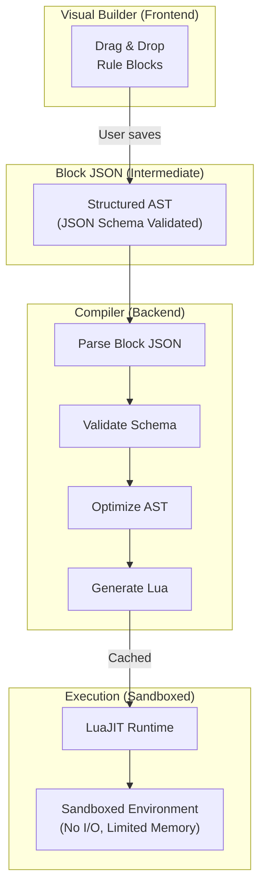
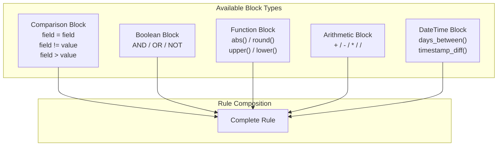

# Rule Expression System

## 1. Overview

The rule expression system enables non-technical users to define complex matching logic through a visual block-based interface. Rules are compiled from Block JSON to Lua for execution.

## 2. Compilation Pipeline



## 3. Block Types



### 3.1 Comparison Block

Compares two values using an operator.

| Operator | Description | Example |
|----------|-------------|---------|
| `=` | Equal | `amount = amount` |
| `!=` | Not equal | `status != 'cancelled'` |
| `>` | Greater than | `date > '2024-01-01'` |
| `>=` | Greater or equal | `balance >= 0` |
| `<` | Less than | `amount < 1000` |
| `<=` | Less or equal | `diff <= 0.01` |
| `contains` | String contains | `name contains 'Corp'` |
| `starts_with` | String prefix | `id starts_with 'TXN'` |
| `ends_with` | String suffix | `ref ends_with '-A'` |
| `matches` | Regex match | `code matches '^[A-Z]{3}$'` |

### 3.2 Boolean Block

Combines multiple conditions.

| Operator | Description | Example |
|----------|-------------|---------|
| `AND` | All must be true | `currency = currency AND amount = amount` |
| `OR` | Any must be true | `status = 'settled' OR status = 'cleared'` |
| `NOT` | Negation | `NOT (status = 'cancelled')` |

### 3.3 Function Block

Transforms values before comparison.

| Function | Description | Example |
|----------|-------------|---------|
| `abs(x)` | Absolute value | `abs(amount_a - amount_b) <= 0.01` |
| `round(x, n)` | Round to n decimals | `round(amount, 2)` |
| `floor(x)` | Round down | `floor(percentage)` |
| `ceil(x)` | Round up | `ceil(quantity)` |
| `upper(s)` | Uppercase | `upper(currency)` |
| `lower(s)` | Lowercase | `lower(name)` |
| `trim(s)` | Remove whitespace | `trim(description)` |
| `len(s)` | String length | `len(reference) > 0` |
| `coalesce(a, b)` | First non-null | `coalesce(alt_id, id)` |

### 3.4 Arithmetic Block

Mathematical operations.

| Operator | Description | Example |
|----------|-------------|---------|
| `+` | Addition | `base + tax` |
| `-` | Subtraction | `gross - fees` |
| `*` | Multiplication | `quantity * price` |
| `/` | Division | `total / count` |
| `%` | Modulo | `id % 100` |

### 3.5 DateTime Block

Date and time operations.

| Function | Description | Example |
|----------|-------------|---------|
| `days_between(a, b)` | Days difference | `days_between(date_a, date_b) <= 3` |
| `hours_between(a, b)` | Hours difference | `hours_between(time_a, time_b) <= 24` |
| `date_part(d, 'year')` | Extract part | `date_part(txn_date, 'month') = 3` |
| `date_add(d, n, 'days')` | Add interval | `date_add(created, 7, 'days')` |
| `date_trunc(d, 'day')` | Truncate | `date_trunc(timestamp, 'day')` |

## 4. Block JSON Schema

### 4.1 Base Node Types

```typescript
type BlockNode =
  | BooleanBlock
  | ComparisonBlock
  | FunctionBlock
  | ArithmeticBlock
  | FieldReference
  | LiteralValue;

interface BooleanBlock {
  type: 'boolean';
  operator: 'AND' | 'OR' | 'NOT';
  children: BlockNode[];
}

interface ComparisonBlock {
  type: 'comparison';
  operator: '=' | '!=' | '>' | '>=' | '<' | '<=' | 'contains' | 'starts_with' | 'ends_with' | 'matches';
  left: BlockNode;
  right: BlockNode;
}

interface FunctionBlock {
  type: 'function';
  name: string;
  args: BlockNode[];
}

interface ArithmeticBlock {
  type: 'arithmetic';
  operator: '+' | '-' | '*' | '/' | '%';
  left: BlockNode;
  right: BlockNode;
}

interface FieldReference {
  type: 'field';
  source: 'left' | 'right';
  name: string;
}

interface LiteralValue {
  type: 'literal';
  value: string | number | boolean | null;
}
```

### 4.2 Complete Example

**Visual Rule**: "Currency must match AND amount difference must be within $0.01"

**Block JSON**:
```json
{
  "type": "boolean",
  "operator": "AND",
  "children": [
    {
      "type": "comparison",
      "left": { "type": "field", "source": "left", "name": "currency" },
      "operator": "=",
      "right": { "type": "field", "source": "right", "name": "currency" }
    },
    {
      "type": "comparison",
      "left": {
        "type": "function",
        "name": "abs",
        "args": [{
          "type": "arithmetic",
          "operator": "-",
          "left": { "type": "field", "source": "left", "name": "amount" },
          "right": { "type": "field", "source": "right", "name": "amount" }
        }]
      },
      "operator": "<=",
      "right": { "type": "literal", "value": 0.01 }
    }
  ]
}
```

**Compiled Lua**:
```lua
function evaluate(left, right)
  return (left.currency == right.currency) and
         (math.abs(left.amount - right.amount) <= 0.01)
end
```

## 5. JSON Schema Definition

```json
{
  "$schema": "https://json-schema.org/draft/2020-12/schema",
  "$id": "https://haqq.io/schemas/block-expression.json",
  "title": "Block Expression",
  "description": "A block-based rule expression for reconciliation matching",

  "definitions": {
    "fieldReference": {
      "type": "object",
      "required": ["type", "source", "name"],
      "properties": {
        "type": { "const": "field" },
        "source": { "enum": ["left", "right"] },
        "name": { "type": "string", "minLength": 1 }
      },
      "additionalProperties": false
    },

    "literalValue": {
      "type": "object",
      "required": ["type", "value"],
      "properties": {
        "type": { "const": "literal" },
        "value": {
          "oneOf": [
            { "type": "string" },
            { "type": "number" },
            { "type": "boolean" },
            { "type": "null" }
          ]
        }
      },
      "additionalProperties": false
    },

    "booleanBlock": {
      "type": "object",
      "required": ["type", "operator", "children"],
      "properties": {
        "type": { "const": "boolean" },
        "operator": { "enum": ["AND", "OR", "NOT"] },
        "children": {
          "type": "array",
          "items": { "$ref": "#/definitions/blockNode" },
          "minItems": 1
        }
      },
      "additionalProperties": false
    },

    "comparisonBlock": {
      "type": "object",
      "required": ["type", "operator", "left", "right"],
      "properties": {
        "type": { "const": "comparison" },
        "operator": {
          "enum": ["=", "!=", ">", ">=", "<", "<=", "contains", "starts_with", "ends_with", "matches"]
        },
        "left": { "$ref": "#/definitions/blockNode" },
        "right": { "$ref": "#/definitions/blockNode" }
      },
      "additionalProperties": false
    },

    "functionBlock": {
      "type": "object",
      "required": ["type", "name", "args"],
      "properties": {
        "type": { "const": "function" },
        "name": {
          "enum": ["abs", "round", "floor", "ceil", "upper", "lower", "trim", "len", "coalesce",
                   "days_between", "hours_between", "date_part", "date_add", "date_trunc"]
        },
        "args": {
          "type": "array",
          "items": { "$ref": "#/definitions/blockNode" }
        }
      },
      "additionalProperties": false
    },

    "arithmeticBlock": {
      "type": "object",
      "required": ["type", "operator", "left", "right"],
      "properties": {
        "type": { "const": "arithmetic" },
        "operator": { "enum": ["+", "-", "*", "/", "%"] },
        "left": { "$ref": "#/definitions/blockNode" },
        "right": { "$ref": "#/definitions/blockNode" }
      },
      "additionalProperties": false
    },

    "blockNode": {
      "oneOf": [
        { "$ref": "#/definitions/booleanBlock" },
        { "$ref": "#/definitions/comparisonBlock" },
        { "$ref": "#/definitions/functionBlock" },
        { "$ref": "#/definitions/arithmeticBlock" },
        { "$ref": "#/definitions/fieldReference" },
        { "$ref": "#/definitions/literalValue" }
      ]
    }
  },

  "$ref": "#/definitions/blockNode"
}
```

## 6. Lua Code Generation

### 6.1 Generation Rules

| Block Type | Lua Output |
|------------|------------|
| `field` (left) | `left.fieldName` |
| `field` (right) | `right.fieldName` |
| `literal` (string) | `"value"` |
| `literal` (number) | `value` |
| `literal` (boolean) | `true` / `false` |
| `literal` (null) | `nil` |
| `comparison` (=) | `left == right` |
| `comparison` (!=) | `left ~= right` |
| `boolean` (AND) | `(a) and (b)` |
| `boolean` (OR) | `(a) or (b)` |
| `boolean` (NOT) | `not (a)` |
| `arithmetic` | `(left op right)` |
| `function` | `func_name(args)` |

### 6.2 Generated Function Template

```lua
-- Auto-generated matching rule
-- Hash: sha256_of_block_json
-- Generated: 2024-03-15T10:00:00Z

local function evaluate(left, right)
  -- Compiled rule expression
  return {{EXPRESSION}}
end

return {
  evaluate = evaluate
}
```

### 6.3 Helper Functions

The Lua runtime includes pre-loaded helper functions:

```lua
-- String operations
function contains(str, substr)
  return string.find(str, substr, 1, true) ~= nil
end

function starts_with(str, prefix)
  return string.sub(str, 1, #prefix) == prefix
end

function ends_with(str, suffix)
  return string.sub(str, -#suffix) == suffix
end

-- Date operations
function days_between(date1, date2)
  return math.floor((date2 - date1) / 86400)
end

function hours_between(time1, time2)
  return math.floor((time2 - time1) / 3600)
end
```

## 7. Validation

### 7.1 Schema Validation
- JSON Schema validation against block expression schema
- Type checking for field references
- Operator compatibility checks

### 7.2 Semantic Validation
- Field existence in source schemas
- Type compatibility (comparing string to number)
- Circular reference detection

### 7.3 Error Messages

```json
{
  "valid": false,
  "errors": [
    {
      "path": "$.children[1].left.name",
      "message": "Field 'ammount' not found in left schema. Did you mean 'amount'?",
      "code": "FIELD_NOT_FOUND"
    }
  ]
}
```

## 8. Optimization

### 8.1 Constant Folding
```json
// Before: abs(-5)
{ "type": "function", "name": "abs", "args": [{ "type": "literal", "value": -5 }] }

// After: 5
{ "type": "literal", "value": 5 }
```

### 8.2 Short-Circuit Evaluation
```lua
-- AND: Stop on first false
-- OR: Stop on first true
return (fast_check) and (slow_check)
```

### 8.3 Caching
- Compiled Lua bytecode cached by Block JSON hash
- Cache invalidation on schema changes
- LRU eviction for memory management
