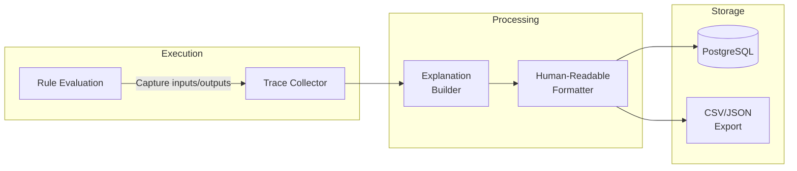
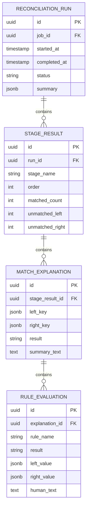

# Explainability System

## 1. Overview

The explainability system provides human-readable audit trails for every match decision. This is critical for:
- Regulatory compliance (audit requirements)
- Debugging matching rules
- End-user transparency
- Dispute resolution

## 2. Explanation Flow



## 3. Data Model



## 4. Trace Collection

### 4.1 What Gets Traced

During rule evaluation, the system captures:

| Data Point | Description |
|------------|-------------|
| **Left Value** | Input value from Source A |
| **Right Value** | Input value from Source B |
| **Intermediate Results** | Function outputs, arithmetic results |
| **Comparison Result** | Boolean outcome of each comparison |
| **Rule Name** | User-defined name or auto-generated label |

### 4.2 Trace Structure

```json
{
  "ruleId": "rule_currency_match",
  "ruleName": "Currency Match",
  "result": "PASSED",
  "inputs": {
    "left": {
      "field": "currency",
      "value": "USD"
    },
    "right": {
      "field": "currency",
      "value": "USD"
    }
  },
  "comparison": {
    "operator": "=",
    "leftValue": "USD",
    "rightValue": "USD",
    "result": true
  }
}
```

### 4.3 Complex Rule Trace

For nested rules with functions:

```json
{
  "ruleId": "rule_amount_tolerance",
  "ruleName": "Amount Tolerance",
  "result": "PASSED",
  "inputs": {
    "left": {
      "field": "amount",
      "value": 100.50
    },
    "right": {
      "field": "amount",
      "value": 100.48
    }
  },
  "steps": [
    {
      "step": 1,
      "operation": "subtract",
      "left": 100.50,
      "right": 100.48,
      "result": 0.02
    },
    {
      "step": 2,
      "operation": "abs",
      "input": 0.02,
      "result": 0.02
    },
    {
      "step": 3,
      "operation": "compare_lte",
      "left": 0.02,
      "right": 0.01,
      "result": false
    }
  ],
  "comparison": {
    "operator": "<=",
    "leftValue": 0.02,
    "rightValue": 0.01,
    "result": false
  }
}
```

## 5. Explanation Builder

### 5.1 Match Explanation Structure

```json
{
  "matchId": "exp_abc123",
  "result": "MATCHED",
  "leftKey": { "transaction_id": "TXN-001" },
  "rightKey": { "transaction_id": "TXN-001" },
  "summary": "Matched with 1 warning",
  "rules": [
    {
      "name": "Currency Match",
      "result": "PASSED",
      "humanText": "Currency matches: USD = USD"
    },
    {
      "name": "Amount Tolerance",
      "result": "PASSED",
      "humanText": "Amount difference ($0.02) is within tolerance ($0.05)"
    },
    {
      "name": "Timestamp Window",
      "result": "WARNING",
      "humanText": "Timestamp difference (20 minutes) exceeds preferred window (15 minutes)"
    }
  ],
  "overallResult": "MATCHED",
  "warnings": 1,
  "failures": 0
}
```

### 5.2 Result Categories

| Result | Description |
|--------|-------------|
| `MATCHED` | All required rules passed |
| `UNMATCHED_LEFT` | No candidate found for left record |
| `UNMATCHED_RIGHT` | No candidate found for right record |
| `MATCH_FAILED` | Candidate found but rules failed |

### 5.3 Rule Result Types

| Type | Description |
|------|-------------|
| `PASSED` | Rule condition satisfied |
| `FAILED` | Rule condition not satisfied |
| `WARNING` | Soft limit exceeded (still matches) |
| `SKIPPED` | Rule not evaluated (short-circuit) |

## 6. Human-Readable Formatter

### 6.1 Format Templates

**Currency Comparison**:
```
✓ PASSED: Currency Match
  • Left currency: {left.currency}
  • Right currency: {right.currency}
  • Rule: currency must be equal
```

**Amount Tolerance**:
```
✓ PASSED: Amount Tolerance
  • Left amount: ${left.amount}
  • Right amount: ${right.amount}
  • Difference: ${abs(left.amount - right.amount)}
  • Allowed tolerance: ${tolerance}
  • Rule: difference must be within tolerance
```

**Failed Comparison**:
```
✗ FAILED: Date Match
  • Left date: {left.date}
  • Right date: {right.date}
  • Difference: {days_between} days
  • Rule: dates must be within 3 days
```

### 6.2 Full Report Example

```
═══════════════════════════════════════════════════════════
Match Report: TXN-001 ↔ TXN-001
═══════════════════════════════════════════════════════════

LEFT RECORD (Internal Ledger)
─────────────────────────────
  Transaction ID: TXN-001
  Amount: $100.50
  Currency: USD
  Date: 2024-03-15 10:00:00

RIGHT RECORD (Bank Statement)
─────────────────────────────
  Transaction ID: TXN-001
  Amount: $100.48
  Currency: USD
  Date: 2024-03-15 10:20:00

RULE EVALUATIONS
─────────────────────────────

✓ PASSED: Currency Match
  • Left currency: USD
  • Right currency: USD
  • Rule: currency must be equal

✓ PASSED: Amount Tolerance
  • Left amount: $100.50
  • Right amount: $100.48
  • Difference: $0.02
  • Allowed tolerance: $0.05
  • Rule: difference must be within tolerance

⚠ WARNING: Timestamp Window
  • Left timestamp: 2024-03-15 10:00:00
  • Right timestamp: 2024-03-15 10:20:00
  • Difference: 20 minutes
  • Allowed window: 15 minutes
  • Rule: timestamps must be within window

═══════════════════════════════════════════════════════════
RESULT: MATCHED (with 1 warning)
═══════════════════════════════════════════════════════════
```

## 7. Storage Strategy

### 7.1 Inline vs Reference

| Scenario | Storage | Rationale |
|----------|---------|-----------|
| Small runs (<10K matches) | Inline JSON | Simpler queries |
| Large runs (>10K matches) | S3 + reference | Cost-effective |
| Audit requirements | Both | Compliance |

### 7.2 Retention Policy

| Data Type | Retention | Storage |
|-----------|-----------|---------|
| Summary | 1 year | PostgreSQL |
| Full explanations | 90 days | PostgreSQL |
| Archived explanations | 7 years | S3 (compressed) |

### 7.3 Compression

Full explanations are compressed using:
- JSONB in PostgreSQL (native compression)
- gzip for S3 archives
- Estimated 10:1 compression ratio

## 8. API Endpoints

### 8.1 Get Run Explanations

```http
GET /api/v1/runs/{runId}/explanations
```

Query parameters:
- `result`: Filter by result (MATCHED, UNMATCHED_LEFT, etc.)
- `limit`: Page size (default 100)
- `offset`: Pagination offset

Response:
```json
{
  "runId": "run_123",
  "total": 1500,
  "results": [
    {
      "matchId": "exp_abc123",
      "result": "MATCHED",
      "leftKey": { "transaction_id": "TXN-001" },
      "rightKey": { "transaction_id": "TXN-001" },
      "summary": "Matched with 1 warning"
    }
  ]
}
```

### 8.2 Get Single Explanation

```http
GET /api/v1/explanations/{matchId}
```

Response: Full explanation with all rule evaluations.

### 8.3 Export Explanations

```http
POST /api/v1/runs/{runId}/explanations/export
Content-Type: application/json

{
  "format": "csv",  // or "json", "pdf"
  "filter": {
    "result": ["MATCH_FAILED", "UNMATCHED_LEFT"]
  }
}
```

Response:
```json
{
  "exportId": "export_xyz",
  "status": "processing",
  "downloadUrl": null
}
```

## 9. Performance Considerations

### 9.1 Batch Writing
- Buffer explanations in memory (1000 records)
- Bulk insert to PostgreSQL
- Async write to avoid blocking matching

### 9.2 Selective Tracing
Configuration options:
```yaml
explainability:
  # Full trace for all records
  mode: full

  # Or sample-based
  mode: sampled
  sampleRate: 0.1  # 10% of records

  # Or failures only
  mode: failures_only
```

### 9.3 Lazy Loading
- Store summary inline
- Load full details on demand
- Cache frequently accessed explanations
