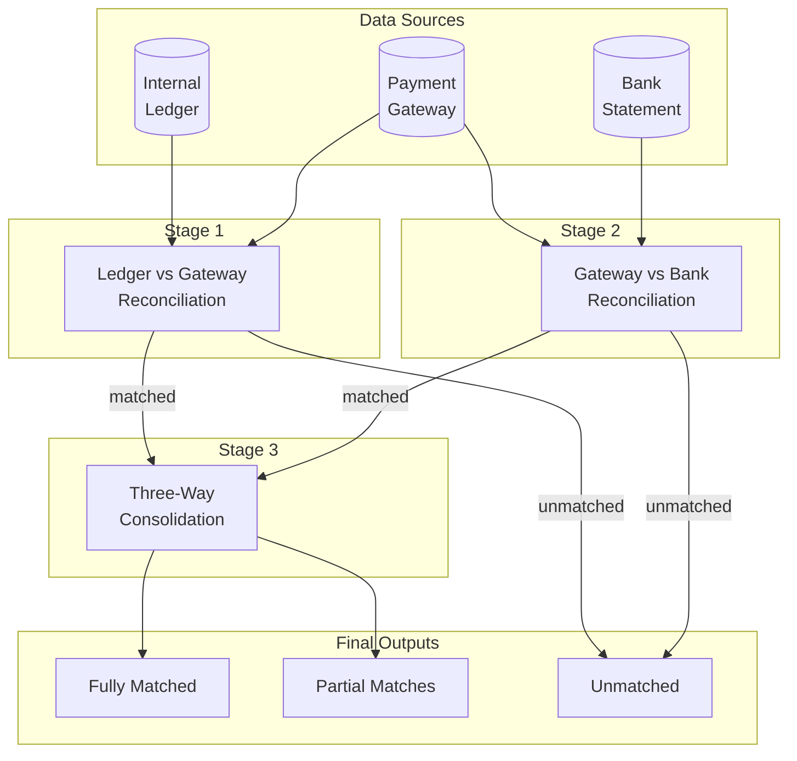
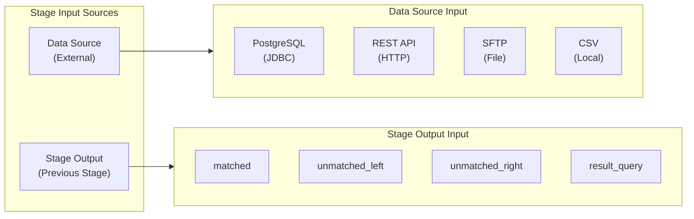
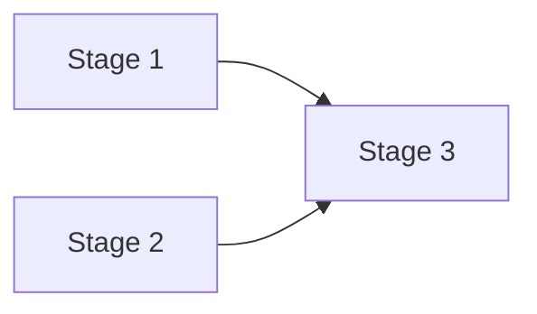
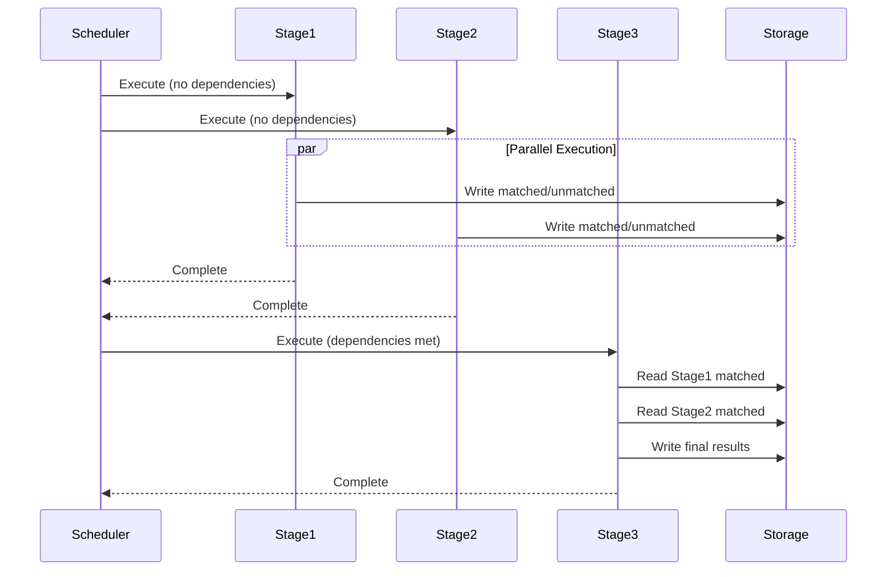
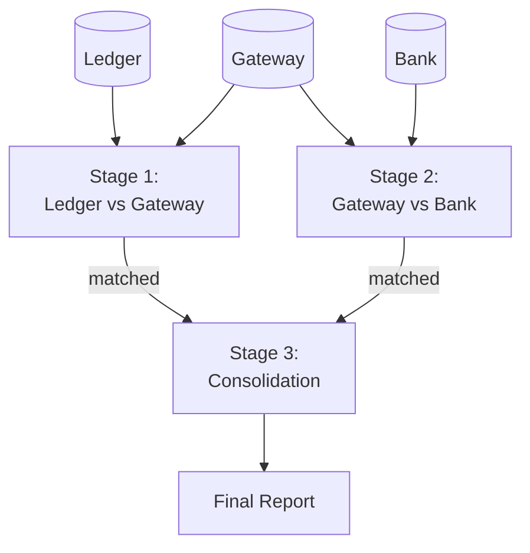
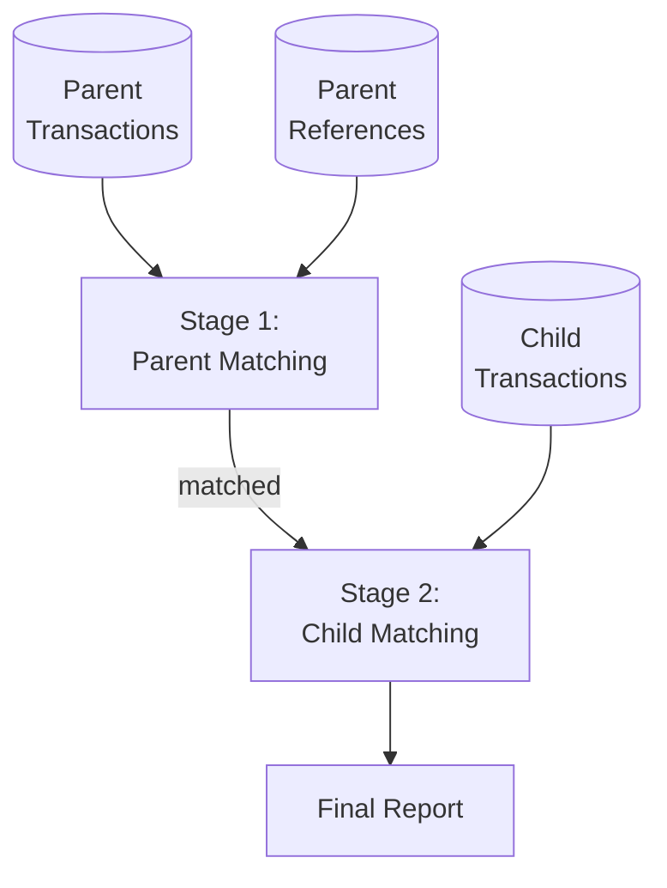
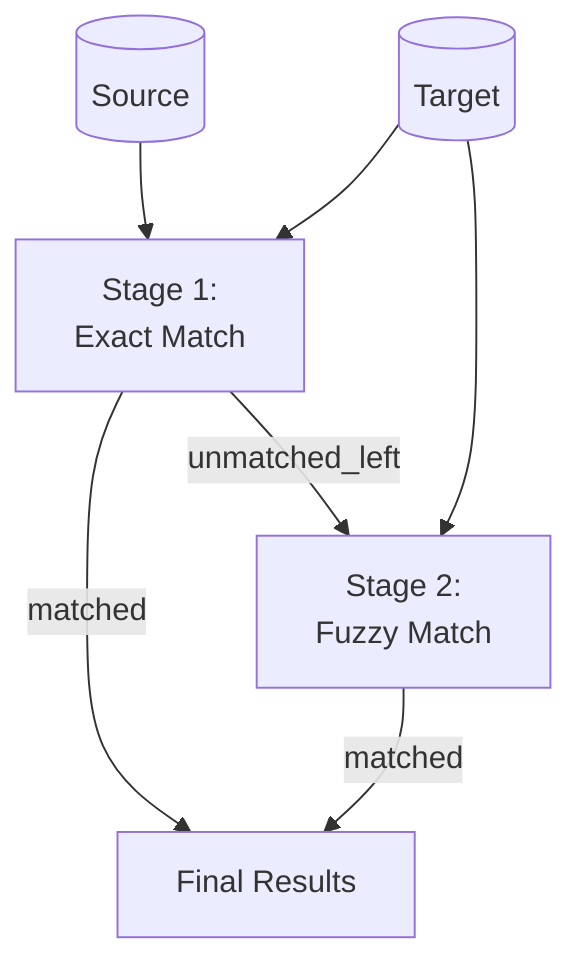

# Multi-Stage Workflows

## 1. Overview

Multi-stage workflows enable complex reconciliation scenarios where:
- Multiple data sources need to be reconciled
- Stages depend on outputs from previous stages
- Results flow through a directed acyclic graph (DAG)

## 2. Workflow DAG Example



## 3. Stage Input Types



### 3.1 Data Source Input

External data from configured sources:

```yaml
datasourceLeft:
  type: datasource
  datasourceId: internal_ledger
```

### 3.2 Stage Output Input

Use output from a previous stage:

```yaml
datasourceLeft:
  type: stage_output
  stageId: stage_1
  outputType: matched  # or unmatched_left, unmatched_right, result_query
```

### 3.3 Result Query Input

Use a custom query on stage results:

```yaml
datasourceLeft:
  type: stage_output
  stageId: stage_1
  outputType: result_query
  queryId: high_value_transactions  # References a result query defined in stage_1
```

## 4. Stage Configuration

### 4.1 Stage Definition

```yaml
stages:
  - id: stage_1
    name: "Ledger vs Gateway"
    order: 1
    mode: one_to_one

    datasourceLeft:
      type: datasource
      datasourceId: internal_ledger

    datasourceRight:
      type: datasource
      datasourceId: payment_gateway

    joinConditions:
      - leftField: transaction_id
        rightField: txn_ref

    matchingRule:
      type: boolean
      operator: AND
      children:
        - type: comparison
          left: { type: field, source: left, name: currency }
          operator: "="
          right: { type: field, source: right, name: currency }
        - type: comparison
          left:
            type: function
            name: abs
            args:
              - type: arithmetic
                operator: "-"
                left: { type: field, source: left, name: amount }
                right: { type: field, source: right, name: amount }
          operator: "<="
          right: { type: literal, value: 0.01 }

    resultQueries:
      - id: high_value
        name: "High Value Matches"
        filter:
          type: comparison
          left: { type: field, source: left, name: amount }
          operator: ">"
          right: { type: literal, value: 10000 }

    outputs:
      matched:
        enabled: true
        path: /results/{run_id}/stage_1/matched.csv
      unmatchedLeft:
        enabled: true
        path: /results/{run_id}/stage_1/unmatched_left.csv
      unmatchedRight:
        enabled: true
        path: /results/{run_id}/stage_1/unmatched_right.csv
```

### 4.2 Stage Dependencies

Dependencies are automatically inferred from input configurations:



If Stage 3 uses outputs from Stage 1 and Stage 2, it waits for both to complete.

## 5. Execution Flow

### 5.1 DAG Execution



### 5.2 Execution Rules

1. **Parallel Execution**: Stages with no dependencies run in parallel
2. **Dependency Wait**: Stage waits for all input stages to complete
3. **Failure Handling**:
   - Continue: Skip failed stage, continue with others
   - Stop: Halt entire workflow on failure
4. **Partial Results**: Downstream stages can use partial results if configured

## 6. Result Aggregation

### 6.1 Stage Outputs

Each stage produces:

| Output | Description |
|--------|-------------|
| `matched` | Records that matched in this stage |
| `unmatched_left` | Left records with no match |
| `unmatched_right` | Right records with no match |
| `match_failed` | Found by key but rules failed |

### 6.2 Final Aggregation

The workflow produces aggregated results:

```yaml
finalResults:
  # All records matched across all stages
  fullyMatched:
    stages: [stage_1, stage_2, stage_3]
    condition: all_matched

  # Records matched in some but not all stages
  partiallyMatched:
    stages: [stage_1, stage_2, stage_3]
    condition: some_matched

  # Records unmatched in any stage
  unmatched:
    stages: [stage_1, stage_2]
    condition: any_unmatched
```

## 7. Result Queries

### 7.1 Definition

Result queries filter stage outputs for downstream stages or reports:

```yaml
resultQueries:
  - id: high_value
    name: "High Value Transactions"
    description: "Transactions over $10,000"
    filter:
      type: comparison
      left: { type: field, source: left, name: amount }
      operator: ">"
      right: { type: literal, value: 10000 }

  - id: currency_mismatch
    name: "Currency Warnings"
    description: "Matches with currency conversion"
    filter:
      type: boolean
      operator: AND
      children:
        - type: comparison
          left: { type: field, source: result, name: result }
          operator: "="
          right: { type: literal, value: "MATCHED" }
        - type: comparison
          left: { type: field, source: left, name: currency }
          operator: "!="
          right: { type: field, source: right, name: currency }
```

### 7.2 Using Result Queries

In a downstream stage:

```yaml
stages:
  - id: stage_2
    datasourceLeft:
      type: stage_output
      stageId: stage_1
      outputType: result_query
      queryId: high_value  # Only high-value matches
```

## 8. Use Cases

### 8.1 Three-Way Reconciliation

Reconcile internal ledger, payment gateway, and bank statement:



### 8.2 Hierarchical Reconciliation

Match parent transactions, then children:



### 8.3 Cascading Reconciliation

Try exact match first, then fuzzy match on failures:



## 9. Configuration Schema

### 9.1 Full Workflow Configuration

```yaml
job:
  id: job_three_way_recon
  name: "Three-Way Bank Reconciliation"
  description: "Reconcile ledger, gateway, and bank"

dataSources:
  - id: internal_ledger
    name: "Internal Ledger"
    type: postgresql
    config:
      connectionString: ${LEDGER_DB_URL}
      query: "SELECT * FROM transactions WHERE date >= :start_date"

  - id: payment_gateway
    name: "Payment Gateway"
    type: rest_api
    config:
      url: https://api.gateway.com/transactions
      headers:
        Authorization: Bearer ${GATEWAY_TOKEN}

  - id: bank_statement
    name: "Bank Statement"
    type: sftp
    config:
      host: sftp.bank.com
      path: /statements/daily.csv

stages:
  - id: stage_ledger_gateway
    name: "Ledger vs Gateway"
    order: 1
    # ... stage config

  - id: stage_gateway_bank
    name: "Gateway vs Bank"
    order: 2
    # ... stage config

  - id: stage_consolidation
    name: "Three-Way Consolidation"
    order: 3
    datasourceLeft:
      type: stage_output
      stageId: stage_ledger_gateway
      outputType: matched
    datasourceRight:
      type: stage_output
      stageId: stage_gateway_bank
      outputType: matched
    # ... stage config

schedule:
  cron: "0 6 * * *"  # Daily at 6 AM
  timezone: UTC
```

## 10. Monitoring & Debugging

### 10.1 Stage Metrics

Each stage tracks:

| Metric | Description |
|--------|-------------|
| `records_left` | Input count from left source |
| `records_right` | Input count from right source |
| `matched_count` | Successfully matched pairs |
| `unmatched_left_count` | Unmatched left records |
| `unmatched_right_count` | Unmatched right records |
| `match_failed_count` | Found but failed rules |
| `duration_ms` | Stage execution time |
| `memory_mb` | Peak memory usage |

### 10.2 Workflow Visualization

The UI displays:
- DAG visualization of stages
- Real-time progress per stage
- Metrics and error counts
- Drill-down to individual explanations
