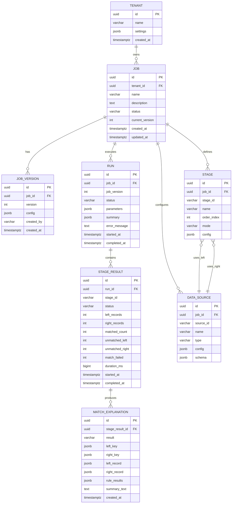

# Database Schema

## 1. Overview

The reconciliation engine uses PostgreSQL for:
- Job configurations
- Execution history
- Match explanations
- Audit logs

## 2. Entity Relationship Diagram



## 3. Table Definitions

### 3.1 Tenants

Multi-tenant support for SaaS deployment.

```sql
CREATE TABLE tenants (
    id UUID PRIMARY KEY DEFAULT gen_random_uuid(),
    name VARCHAR(255) NOT NULL,
    slug VARCHAR(100) UNIQUE NOT NULL,
    settings JSONB DEFAULT '{}',
    status VARCHAR(50) DEFAULT 'active',
    created_at TIMESTAMPTZ DEFAULT NOW(),
    updated_at TIMESTAMPTZ DEFAULT NOW()
);

CREATE INDEX idx_tenants_slug ON tenants(slug);
CREATE INDEX idx_tenants_status ON tenants(status);
```

### 3.2 Jobs

Reconciliation job configurations.

```sql
CREATE TABLE jobs (
    id UUID PRIMARY KEY DEFAULT gen_random_uuid(),
    tenant_id UUID NOT NULL REFERENCES tenants(id),
    name VARCHAR(255) NOT NULL,
    description TEXT,
    status VARCHAR(50) DEFAULT 'active',
    current_version INT DEFAULT 1,
    schedule_cron VARCHAR(100),
    schedule_timezone VARCHAR(50) DEFAULT 'UTC',
    last_run_at TIMESTAMPTZ,
    last_run_status VARCHAR(50),
    created_by VARCHAR(255),
    updated_by VARCHAR(255),
    created_at TIMESTAMPTZ DEFAULT NOW(),
    updated_at TIMESTAMPTZ DEFAULT NOW(),

    CONSTRAINT jobs_name_tenant_unique UNIQUE (tenant_id, name)
);

CREATE INDEX idx_jobs_tenant ON jobs(tenant_id);
CREATE INDEX idx_jobs_status ON jobs(status);
CREATE INDEX idx_jobs_schedule ON jobs(schedule_cron) WHERE schedule_cron IS NOT NULL;
```

### 3.3 Job Versions

Version history for job configurations.

```sql
CREATE TABLE job_versions (
    id UUID PRIMARY KEY DEFAULT gen_random_uuid(),
    job_id UUID NOT NULL REFERENCES jobs(id) ON DELETE CASCADE,
    version INT NOT NULL,
    config JSONB NOT NULL,
    change_summary TEXT,
    created_by VARCHAR(255),
    created_at TIMESTAMPTZ DEFAULT NOW(),

    CONSTRAINT job_versions_unique UNIQUE (job_id, version)
);

CREATE INDEX idx_job_versions_job ON job_versions(job_id);
```

### 3.4 Data Sources

Data source configurations for jobs.

```sql
CREATE TABLE data_sources (
    id UUID PRIMARY KEY DEFAULT gen_random_uuid(),
    job_id UUID NOT NULL REFERENCES jobs(id) ON DELETE CASCADE,
    source_id VARCHAR(100) NOT NULL,
    name VARCHAR(255) NOT NULL,
    type VARCHAR(50) NOT NULL,
    config JSONB NOT NULL,
    schema_definition JSONB,
    created_at TIMESTAMPTZ DEFAULT NOW(),
    updated_at TIMESTAMPTZ DEFAULT NOW(),

    CONSTRAINT data_sources_unique UNIQUE (job_id, source_id)
);

CREATE INDEX idx_data_sources_job ON data_sources(job_id);
CREATE INDEX idx_data_sources_type ON data_sources(type);
```

### 3.5 Stages

Stage configurations for multi-stage workflows.

```sql
CREATE TABLE stages (
    id UUID PRIMARY KEY DEFAULT gen_random_uuid(),
    job_id UUID NOT NULL REFERENCES jobs(id) ON DELETE CASCADE,
    stage_id VARCHAR(100) NOT NULL,
    name VARCHAR(255) NOT NULL,
    order_index INT NOT NULL,
    mode VARCHAR(50) DEFAULT 'one_to_one',
    datasource_left JSONB NOT NULL,
    datasource_right JSONB NOT NULL,
    join_conditions JSONB NOT NULL,
    matching_rule JSONB NOT NULL,
    result_queries JSONB DEFAULT '[]',
    output_config JSONB DEFAULT '{}',
    created_at TIMESTAMPTZ DEFAULT NOW(),
    updated_at TIMESTAMPTZ DEFAULT NOW(),

    CONSTRAINT stages_unique UNIQUE (job_id, stage_id)
);

CREATE INDEX idx_stages_job ON stages(job_id);
CREATE INDEX idx_stages_order ON stages(job_id, order_index);
```

### 3.6 Runs

Execution history for jobs.

```sql
CREATE TABLE runs (
    id UUID PRIMARY KEY DEFAULT gen_random_uuid(),
    job_id UUID NOT NULL REFERENCES jobs(id),
    job_version INT NOT NULL,
    status VARCHAR(50) NOT NULL DEFAULT 'pending',
    parameters JSONB DEFAULT '{}',
    config_snapshot JSONB,
    summary JSONB,
    error_message TEXT,
    triggered_by VARCHAR(50) DEFAULT 'manual',
    triggered_by_user VARCHAR(255),
    started_at TIMESTAMPTZ,
    completed_at TIMESTAMPTZ,
    created_at TIMESTAMPTZ DEFAULT NOW()
);

CREATE INDEX idx_runs_job ON runs(job_id);
CREATE INDEX idx_runs_status ON runs(status);
CREATE INDEX idx_runs_started ON runs(started_at DESC);
CREATE INDEX idx_runs_job_started ON runs(job_id, started_at DESC);

-- Partial index for active runs
CREATE INDEX idx_runs_active ON runs(job_id)
    WHERE status IN ('pending', 'running');
```

### 3.7 Stage Results

Per-stage execution results.

```sql
CREATE TABLE stage_results (
    id UUID PRIMARY KEY DEFAULT gen_random_uuid(),
    run_id UUID NOT NULL REFERENCES runs(id) ON DELETE CASCADE,
    stage_id VARCHAR(100) NOT NULL,
    stage_name VARCHAR(255),
    status VARCHAR(50) NOT NULL DEFAULT 'pending',
    left_records INT DEFAULT 0,
    right_records INT DEFAULT 0,
    matched_count INT DEFAULT 0,
    unmatched_left INT DEFAULT 0,
    unmatched_right INT DEFAULT 0,
    match_failed INT DEFAULT 0,
    duration_ms BIGINT,
    output_paths JSONB DEFAULT '{}',
    error_message TEXT,
    started_at TIMESTAMPTZ,
    completed_at TIMESTAMPTZ,

    CONSTRAINT stage_results_unique UNIQUE (run_id, stage_id)
);

CREATE INDEX idx_stage_results_run ON stage_results(run_id);
CREATE INDEX idx_stage_results_status ON stage_results(status);
```

### 3.8 Match Explanations

Detailed explanations for individual matches.

```sql
CREATE TABLE match_explanations (
    id UUID PRIMARY KEY DEFAULT gen_random_uuid(),
    stage_result_id UUID NOT NULL REFERENCES stage_results(id) ON DELETE CASCADE,
    result VARCHAR(50) NOT NULL,
    left_key JSONB NOT NULL,
    right_key JSONB,
    left_record JSONB,
    right_record JSONB,
    rule_results JSONB,
    summary_text TEXT,
    created_at TIMESTAMPTZ DEFAULT NOW()
);

CREATE INDEX idx_explanations_stage ON match_explanations(stage_result_id);
CREATE INDEX idx_explanations_result ON match_explanations(result);
CREATE INDEX idx_explanations_left_key ON match_explanations USING GIN (left_key);

-- Partitioning for large datasets (by month)
-- CREATE TABLE match_explanations_2024_03 PARTITION OF match_explanations
--     FOR VALUES FROM ('2024-03-01') TO ('2024-04-01');
```

### 3.9 Audit Logs

System audit trail.

```sql
CREATE TABLE audit_logs (
    id UUID PRIMARY KEY DEFAULT gen_random_uuid(),
    tenant_id UUID REFERENCES tenants(id),
    entity_type VARCHAR(50) NOT NULL,
    entity_id UUID NOT NULL,
    action VARCHAR(50) NOT NULL,
    actor_id VARCHAR(255),
    actor_type VARCHAR(50),
    changes JSONB,
    metadata JSONB DEFAULT '{}',
    ip_address INET,
    user_agent TEXT,
    created_at TIMESTAMPTZ DEFAULT NOW()
);

CREATE INDEX idx_audit_tenant ON audit_logs(tenant_id);
CREATE INDEX idx_audit_entity ON audit_logs(entity_type, entity_id);
CREATE INDEX idx_audit_actor ON audit_logs(actor_id);
CREATE INDEX idx_audit_created ON audit_logs(created_at DESC);
```

## 4. JSONB Schemas

### 4.1 Job Config (job_versions.config)

```json
{
  "dataSources": [
    {
      "id": "source_id",
      "name": "Source Name",
      "type": "postgresql",
      "config": {}
    }
  ],
  "stages": [
    {
      "id": "stage_id",
      "name": "Stage Name",
      "order": 1,
      "mode": "one_to_one",
      "datasourceLeft": {},
      "datasourceRight": {},
      "joinConditions": [],
      "matchingRule": {},
      "resultQueries": [],
      "outputs": {}
    }
  ],
  "schedule": {
    "cron": "0 6 * * *",
    "timezone": "UTC"
  }
}
```

### 4.2 Run Summary (runs.summary)

```json
{
  "totalLeftRecords": 150000,
  "totalRightRecords": 148500,
  "matched": 145000,
  "unmatchedLeft": 2500,
  "unmatchedRight": 1500,
  "matchFailed": 2000,
  "matchRate": 96.67,
  "durationMs": 12450,
  "stagesSummary": [
    {
      "stageId": "stage_main",
      "matched": 145000,
      "matchRate": 96.67
    }
  ]
}
```

### 4.3 Rule Results (match_explanations.rule_results)

```json
[
  {
    "ruleName": "Currency Match",
    "result": "PASSED",
    "leftValue": "USD",
    "rightValue": "USD",
    "humanText": "Currency matches: USD = USD"
  },
  {
    "ruleName": "Amount Tolerance",
    "result": "FAILED",
    "leftValue": 100.50,
    "rightValue": 105.00,
    "humanText": "Amount mismatch: $100.50 != $105.00"
  }
]
```

## 5. Indexes

### 5.1 Performance Indexes

```sql
-- Full-text search on job names
CREATE INDEX idx_jobs_name_search ON jobs
    USING GIN (to_tsvector('english', name || ' ' || COALESCE(description, '')));

-- JSONB index for config queries
CREATE INDEX idx_job_versions_config ON job_versions USING GIN (config);

-- Composite index for common queries
CREATE INDEX idx_runs_job_status_started ON runs(job_id, status, started_at DESC);
```

### 5.2 Partial Indexes

```sql
-- Only index active jobs
CREATE INDEX idx_jobs_active ON jobs(tenant_id, name)
    WHERE status = 'active';

-- Only index recent runs
CREATE INDEX idx_runs_recent ON runs(job_id, started_at DESC)
    WHERE started_at > NOW() - INTERVAL '90 days';
```

## 6. Partitioning Strategy

For high-volume tables:

```sql
-- Partition match_explanations by month
CREATE TABLE match_explanations (
    id UUID NOT NULL DEFAULT gen_random_uuid(),
    stage_result_id UUID NOT NULL,
    result VARCHAR(50) NOT NULL,
    left_key JSONB NOT NULL,
    right_key JSONB,
    created_at TIMESTAMPTZ DEFAULT NOW()
) PARTITION BY RANGE (created_at);

-- Create monthly partitions
CREATE TABLE match_explanations_2024_01
    PARTITION OF match_explanations
    FOR VALUES FROM ('2024-01-01') TO ('2024-02-01');

CREATE TABLE match_explanations_2024_02
    PARTITION OF match_explanations
    FOR VALUES FROM ('2024-02-01') TO ('2024-03-01');

-- Automated partition management via pg_partman or cron job
```

## 7. Data Retention

```sql
-- Function to archive old explanations
CREATE OR REPLACE FUNCTION archive_old_explanations()
RETURNS void AS $$
BEGIN
    -- Move to archive table
    INSERT INTO match_explanations_archive
    SELECT * FROM match_explanations
    WHERE created_at < NOW() - INTERVAL '90 days';

    -- Delete from main table
    DELETE FROM match_explanations
    WHERE created_at < NOW() - INTERVAL '90 days';
END;
$$ LANGUAGE plpgsql;

-- Schedule with pg_cron
SELECT cron.schedule('archive-explanations', '0 2 * * 0', 'SELECT archive_old_explanations()');
```

## 8. Migrations

### 8.1 Initial Migration

```sql
-- migrations/001_initial_schema.sql

BEGIN;

CREATE EXTENSION IF NOT EXISTS "uuid-ossp";
CREATE EXTENSION IF NOT EXISTS "pg_trgm";

-- Create all tables...

COMMIT;
```

### 8.2 Migration Tool

Use golang-migrate or similar:

```bash
# Apply migrations
migrate -path ./migrations -database "$DATABASE_URL" up

# Rollback
migrate -path ./migrations -database "$DATABASE_URL" down 1
```
