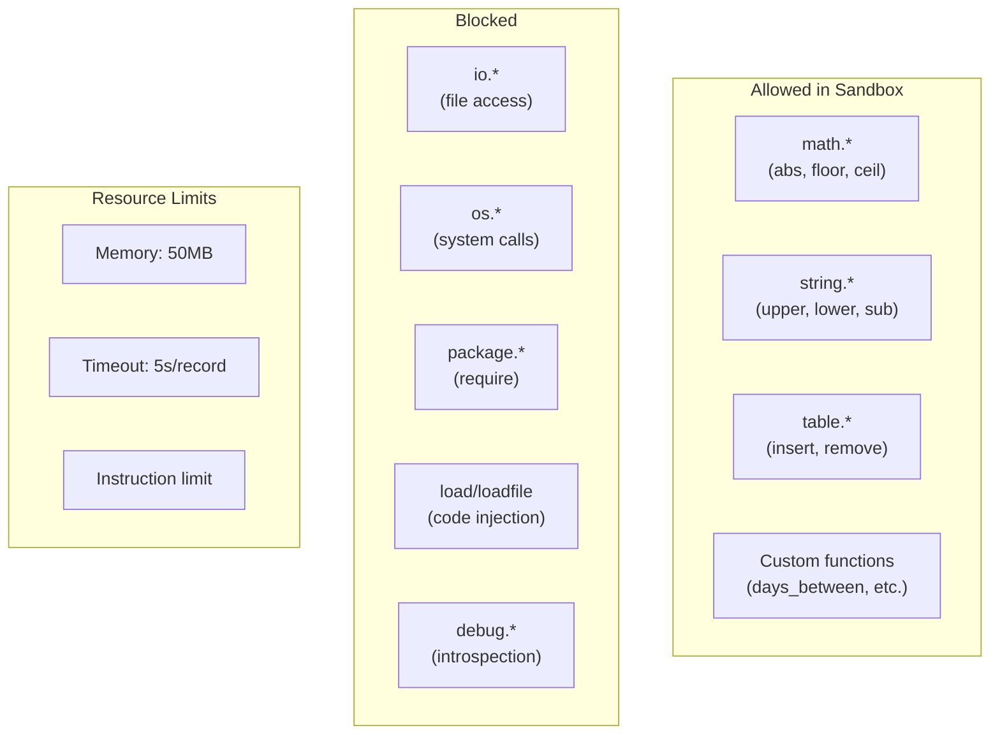
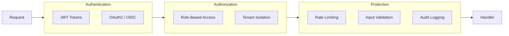

# Security Considerations

## 1. Overview

Security is critical for a financial reconciliation system handling sensitive transaction data. This document covers:
- Lua sandbox security
- API authentication and authorization
- Data protection
- Audit logging

## 2. Lua Sandbox

The Lua runtime is sandboxed to prevent malicious code execution from user-defined rules.



### 2.1 Allowed Functions

| Category | Functions | Purpose |
|----------|-----------|---------|
| **Math** | `abs`, `floor`, `ceil`, `round`, `max`, `min`, `sqrt` | Numeric calculations |
| **String** | `upper`, `lower`, `sub`, `len`, `find`, `gsub`, `format` | String manipulation |
| **Table** | `insert`, `remove`, `concat`, `sort` | Collection operations |
| **Type** | `type`, `tonumber`, `tostring` | Type conversion |
| **Custom** | `days_between`, `hours_between`, `coalesce`, `contains` | Domain-specific |

### 2.2 Blocked Functions

| Function | Risk | Blocked |
|----------|------|---------|
| `io.*` | File system access | All |
| `os.execute` | Command execution | Yes |
| `os.remove` | File deletion | Yes |
| `os.rename` | File modification | Yes |
| `os.exit` | Process termination | Yes |
| `os.getenv` | Environment leakage | Yes |
| `package.*` | Module loading | All |
| `require` | External code | Yes |
| `load`, `loadfile`, `loadstring` | Code injection | Yes |
| `dofile` | External execution | Yes |
| `debug.*` | Runtime introspection | All |
| `rawget`, `rawset` | Metatable bypass | Yes |
| `setmetatable` | Metatable modification | Yes |
| `collectgarbage` | GC manipulation | Yes |

### 2.3 Safe Functions Whitelist

```go
// Go implementation of Lua sandbox
func createSandboxedState() *lua.LState {
    L := lua.NewState(lua.Options{
        SkipOpenLibs: true, // Don't load any libs by default
    })

    // Load only safe base functions
    for _, fn := range []string{"type", "tonumber", "tostring", "pairs", "ipairs", "next", "select", "unpack"} {
        L.SetGlobal(fn, L.GetGlobal(fn))
    }

    // Load safe math functions
    mathLib := L.NewTable()
    safeMath := []string{"abs", "floor", "ceil", "max", "min", "sqrt", "pow", "fmod"}
    for _, fn := range safeMath {
        mathLib.RawSetString(fn, lua.LuaMath.RawGetString(fn))
    }
    L.SetGlobal("math", mathLib)

    // Load safe string functions
    stringLib := L.NewTable()
    safeString := []string{"upper", "lower", "sub", "len", "find", "gsub", "format", "byte", "char"}
    for _, fn := range safeString {
        stringLib.RawSetString(fn, lua.LuaString.RawGetString(fn))
    }
    L.SetGlobal("string", stringLib)

    // Add custom domain functions
    addCustomFunctions(L)

    return L
}
```

### 2.4 Resource Limits

```go
// Execution limits
type SandboxConfig struct {
    MaxMemoryBytes    int64         // 50MB default
    MaxExecutionTime  time.Duration // 5s per record
    MaxInstructions   int64         // 10M instructions
    MaxStringLength   int           // 1MB
    MaxTableSize      int           // 100K entries
}

// Enforce limits during execution
func executeWithLimits(L *lua.LState, config SandboxConfig) error {
    // Set memory limit
    L.SetMx(config.MaxMemoryBytes)

    // Set instruction count hook
    instructionCount := int64(0)
    L.SetHook(func(L *lua.LState, ar *lua.Debug) {
        instructionCount++
        if instructionCount > config.MaxInstructions {
            L.RaiseError("instruction limit exceeded")
        }
    }, lua.HookCount, 1000)

    // Execute with timeout
    ctx, cancel := context.WithTimeout(context.Background(), config.MaxExecutionTime)
    defer cancel()

    L.SetContext(ctx)
    return L.PCall(0, lua.MultRet, nil)
}
```

## 3. API Security



### 3.1 Authentication

#### JWT Token Structure

```json
{
  "header": {
    "alg": "RS256",
    "typ": "JWT"
  },
  "payload": {
    "sub": "user_abc123",
    "iss": "recon-engine",
    "aud": "recon-api",
    "exp": 1710547200,
    "iat": 1710460800,
    "tenant_id": "tenant_xyz",
    "roles": ["admin", "operator"],
    "permissions": ["jobs:read", "jobs:write", "runs:execute"]
  }
}
```

#### Authentication Middleware

```go
func AuthMiddleware() gin.HandlerFunc {
    return func(c *gin.Context) {
        token := extractToken(c.GetHeader("Authorization"))
        if token == "" {
            c.AbortWithStatusJSON(401, gin.H{"error": "missing token"})
            return
        }

        claims, err := validateToken(token)
        if err != nil {
            c.AbortWithStatusJSON(401, gin.H{"error": "invalid token"})
            return
        }

        c.Set("user_id", claims.Subject)
        c.Set("tenant_id", claims.TenantID)
        c.Set("roles", claims.Roles)
        c.Set("permissions", claims.Permissions)
        c.Next()
    }
}
```

### 3.2 Authorization (RBAC)

#### Roles and Permissions

| Role | Permissions |
|------|-------------|
| **viewer** | `jobs:read`, `runs:read`, `reports:read` |
| **operator** | viewer + `runs:execute`, `runs:cancel` |
| **editor** | operator + `jobs:write`, `jobs:delete` |
| **admin** | editor + `users:manage`, `settings:manage` |

#### Permission Checks

```go
func RequirePermission(permission string) gin.HandlerFunc {
    return func(c *gin.Context) {
        permissions := c.GetStringSlice("permissions")
        if !contains(permissions, permission) {
            c.AbortWithStatusJSON(403, gin.H{
                "error": "insufficient permissions",
                "required": permission,
            })
            return
        }
        c.Next()
    }
}

// Usage
router.POST("/jobs", RequirePermission("jobs:write"), createJob)
router.POST("/jobs/:id/run", RequirePermission("runs:execute"), runJob)
```

### 3.3 Tenant Isolation

```go
// Ensure all queries are scoped to tenant
func TenantScope(c *gin.Context) *gorm.DB {
    tenantID := c.GetString("tenant_id")
    return db.Where("tenant_id = ?", tenantID)
}

// Example usage
func getJobs(c *gin.Context) {
    var jobs []Job
    TenantScope(c).Find(&jobs)
    c.JSON(200, jobs)
}
```

### 3.4 Rate Limiting

```go
// Per-tenant rate limits
var rateLimits = map[string]rate.Limit{
    "api:read":     100,  // 100 req/sec
    "api:write":    20,   // 20 req/sec
    "runs:execute": 5,    // 5 runs/sec
}

func RateLimitMiddleware(limitKey string) gin.HandlerFunc {
    return func(c *gin.Context) {
        tenantID := c.GetString("tenant_id")
        key := fmt.Sprintf("%s:%s", tenantID, limitKey)

        limiter := getLimiter(key, rateLimits[limitKey])
        if !limiter.Allow() {
            c.AbortWithStatusJSON(429, gin.H{
                "error": "rate limit exceeded",
                "retry_after": limiter.RetryAfter(),
            })
            return
        }
        c.Next()
    }
}
```

## 4. Data Protection

### 4.1 Encryption at Rest

| Data | Storage | Encryption |
|------|---------|------------|
| Job configs | PostgreSQL | AES-256 (TDE) |
| Credentials | Secrets | Kubernetes Secrets (encrypted etcd) |
| Results | S3/MinIO | Server-side encryption (SSE-S3) |
| Audit logs | PostgreSQL | AES-256 |

### 4.2 Encryption in Transit

```yaml
# TLS configuration
tls:
  enabled: true
  minVersion: "1.2"
  cipherSuites:
    - TLS_ECDHE_RSA_WITH_AES_256_GCM_SHA384
    - TLS_ECDHE_RSA_WITH_AES_128_GCM_SHA256
```

### 4.3 Sensitive Data Handling

```go
// Mask sensitive fields in logs
type DataSource struct {
    ID       string `json:"id"`
    Name     string `json:"name"`
    Type     string `json:"type"`
    Config   Config `json:"config"`
}

type Config struct {
    ConnectionString string `json:"connectionString,omitempty" log:"-"` // Never log
    Password         string `json:"password,omitempty" log:"[REDACTED]"`
    APIKey           string `json:"apiKey,omitempty" log:"[REDACTED]"`
}

// Redact before logging
func (c Config) MarshalLog() map[string]interface{} {
    return map[string]interface{}{
        "connectionString": "[REDACTED]",
        "password":         "[REDACTED]",
        "apiKey":          "[REDACTED]",
    }
}
```

### 4.4 Secret Management

```yaml
# External secrets operator
apiVersion: external-secrets.io/v1beta1
kind: ExternalSecret
metadata:
  name: recon-secrets
spec:
  refreshInterval: 1h
  secretStoreRef:
    name: vault-backend
    kind: ClusterSecretStore
  target:
    name: recon-secrets
  data:
    - secretKey: database-url
      remoteRef:
        key: recon/database
        property: url
    - secretKey: encryption-key
      remoteRef:
        key: recon/encryption
        property: key
```

## 5. Audit Logging

### 5.1 Audit Events

| Event | Logged Data |
|-------|-------------|
| `job.created` | Job ID, creator, config summary |
| `job.updated` | Job ID, updater, changes |
| `job.deleted` | Job ID, deleter |
| `run.started` | Run ID, job ID, parameters |
| `run.completed` | Run ID, status, summary |
| `run.cancelled` | Run ID, canceller, reason |
| `auth.login` | User ID, IP, method |
| `auth.logout` | User ID |
| `auth.failed` | Attempted user, IP, reason |

### 5.2 Audit Log Structure

```json
{
  "id": "audit_abc123",
  "timestamp": "2024-03-15T10:00:00Z",
  "tenant_id": "tenant_xyz",
  "event_type": "job.created",
  "actor": {
    "id": "user_def456",
    "type": "user",
    "ip": "192.168.1.100",
    "user_agent": "Mozilla/5.0..."
  },
  "resource": {
    "type": "job",
    "id": "job_ghi789"
  },
  "action": "create",
  "status": "success",
  "details": {
    "job_name": "Daily Reconciliation",
    "stages_count": 2
  },
  "request_id": "req_jkl012"
}
```

### 5.3 Audit Log Implementation

```go
func AuditLog(event AuditEvent) {
    log := AuditLogEntry{
        ID:        generateID(),
        Timestamp: time.Now(),
        TenantID:  event.TenantID,
        EventType: event.Type,
        Actor: Actor{
            ID:        event.ActorID,
            Type:      event.ActorType,
            IP:        event.IP,
            UserAgent: event.UserAgent,
        },
        Resource: Resource{
            Type: event.ResourceType,
            ID:   event.ResourceID,
        },
        Action:    event.Action,
        Status:    event.Status,
        Details:   event.Details,
        RequestID: event.RequestID,
    }

    // Write to database
    db.Create(&log)

    // Also send to external SIEM if configured
    if siemEnabled {
        siem.Send(log)
    }
}
```

## 6. Input Validation

### 6.1 Request Validation

```go
type CreateJobRequest struct {
    Name        string       `json:"name" binding:"required,min=1,max=255"`
    Description string       `json:"description" binding:"max=2000"`
    DataSources []DataSource `json:"dataSources" binding:"required,min=1,max=10,dive"`
    Stages      []Stage      `json:"stages" binding:"required,min=1,max=20,dive"`
}

type Stage struct {
    ID           string          `json:"id" binding:"required,alphanum,max=100"`
    Name         string          `json:"name" binding:"required,max=255"`
    MatchingRule json.RawMessage `json:"matchingRule" binding:"required"`
}

func createJob(c *gin.Context) {
    var req CreateJobRequest
    if err := c.ShouldBindJSON(&req); err != nil {
        c.JSON(400, gin.H{"error": formatValidationError(err)})
        return
    }

    // Additional semantic validation
    if err := validateJobConfig(req); err != nil {
        c.JSON(422, gin.H{"error": err.Error()})
        return
    }

    // Process request...
}
```

### 6.2 Block JSON Validation

```go
func validateBlockJSON(rule json.RawMessage) error {
    // JSON Schema validation
    schema := loadSchema("block-expression.json")
    result, err := schema.Validate(gojsonschema.NewBytesLoader(rule))
    if err != nil {
        return err
    }
    if !result.Valid() {
        return formatSchemaErrors(result.Errors())
    }

    // Additional semantic checks
    return validateSemantics(rule)
}

func validateSemantics(rule json.RawMessage) error {
    var node BlockNode
    json.Unmarshal(rule, &node)

    // Check for circular references
    if hasCircularReference(node) {
        return errors.New("circular reference detected")
    }

    // Check nesting depth
    if depth := maxDepth(node); depth > 10 {
        return errors.New("expression too deeply nested")
    }

    // Check for dangerous patterns
    if containsDangerousPattern(node) {
        return errors.New("potentially dangerous pattern detected")
    }

    return nil
}
```

## 7. Security Headers

```go
func SecurityHeaders() gin.HandlerFunc {
    return func(c *gin.Context) {
        c.Header("X-Content-Type-Options", "nosniff")
        c.Header("X-Frame-Options", "DENY")
        c.Header("X-XSS-Protection", "1; mode=block")
        c.Header("Content-Security-Policy", "default-src 'self'")
        c.Header("Strict-Transport-Security", "max-age=31536000; includeSubDomains")
        c.Header("Referrer-Policy", "strict-origin-when-cross-origin")
        c.Next()
    }
}
```

## 8. Security Checklist

### 8.1 Development

- [ ] All dependencies scanned for vulnerabilities
- [ ] Static code analysis (SAST) in CI/CD
- [ ] Secrets never committed to repository
- [ ] Input validation on all endpoints
- [ ] Output encoding for XSS prevention

### 8.2 Deployment

- [ ] TLS 1.2+ for all connections
- [ ] Network policies restricting pod communication
- [ ] Resource limits on all containers
- [ ] Read-only root filesystem where possible
- [ ] Non-root container users

### 8.3 Operations

- [ ] Audit logging enabled
- [ ] Log aggregation configured
- [ ] Alerts for security events
- [ ] Regular security scans
- [ ] Incident response plan documented
