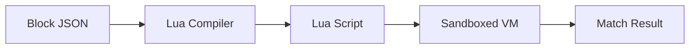
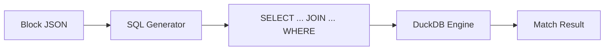
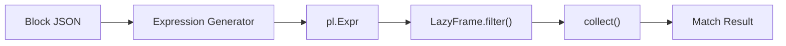
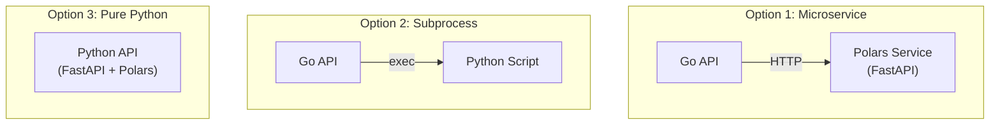
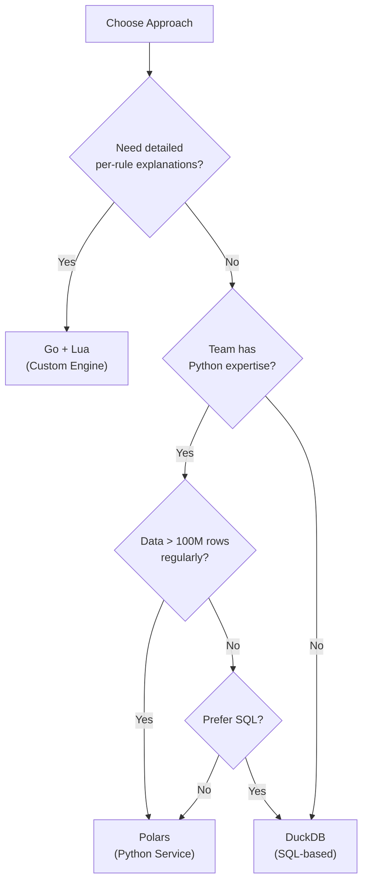
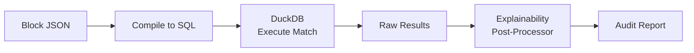

# Alternative Approaches

## 1. Overview

This document explores alternative technologies for the reconciliation engine's data processing layer and compares them against the custom Go + Lua approach:

| Approach | Technology | Description |
|----------|------------|-------------|
| **Custom Engine** | Go + Lua | Custom Hash Join with embedded Lua for rule evaluation |
| **DuckDB** | Embedded SQL | Analytical SQL database with vectorized execution |
| **Polars** | Python DataFrame | High-performance DataFrame library with lazy evaluation |

## 2. Architecture Comparison

```mermaid
flowchart TB
    subgraph Custom["Approach 1: Go + Lua (Custom)"]
        C1["Data Loader"] --> C2["Hash Join<br/>(Go)"]
        C2 --> C3["Rule Evaluator<br/>(Lua VM)"]
        C3 --> C4["Explainability<br/>Engine"]
        C4 --> C5["Results"]
    end

    subgraph DuckDB["Approach 2: DuckDB"]
        D1["Data Sources"] --> D2["DuckDB Engine"]
        D2 --> D3["SQL JOIN +<br/>WHERE Clause"]
        D3 --> D4["Results"]
    end

    subgraph Polars["Approach 3: Polars"]
        P1["Data Sources"] --> P2["LazyFrame"]
        P2 --> P3["Join + Filter<br/>Expressions"]
        P3 --> P4["Results"]
    end
```



---

## 3. Approach 1: Custom Engine (Go + Lua)

### 3.1 How It Works

- **Go**: Handles data loading, Hash Join algorithm, orchestration
- **Lua**: Sandboxed runtime for user-defined matching rules
- **Block JSON**: Visual builder output compiled to Lua code



### 3.2 Pros

| Advantage | Description |
|-----------|-------------|
| **Full Control** | Complete control over matching algorithm and optimizations |
| **Rich Explainability** | Can capture per-rule, per-field traces during evaluation |
| **Single Binary** | Deploy as one Go binary, no external dependencies |
| **Sandboxed Rules** | Lua sandbox prevents malicious code execution |
| **Custom Functions** | Easy to add domain-specific functions (e.g., `days_between`) |
| **Streaming Support** | Can implement custom streaming for memory efficiency |
| **No Python Dependency** | Simpler deployment in Go/K8s environments |
| **Debugging** | Full visibility into matching logic and performance |

### 3.3 Cons

| Disadvantage | Description |
|--------------|-------------|
| **Development Effort** | Must build and maintain custom matching engine |
| **Performance Tuning** | Manual optimization required for large datasets |
| **Testing Burden** | Need comprehensive tests for matching correctness |
| **Lua Limitations** | Lua is less familiar to most developers |
| **No SQL Support** | Can't leverage existing SQL skills |
| **Reinventing Wheel** | Building what databases already do well |
| **Bug Risk** | Custom code = custom bugs in critical path |

### 3.4 Best For

- Applications requiring **detailed audit trails** with per-rule explanations
- Teams with **Go expertise** and willingness to maintain custom code
- Scenarios needing **highly customized matching logic**
- **Single-tenant deployments** where simplicity matters

---

## 4. Approach 2: DuckDB

### 4.1 How It Works

- Rules compile to SQL WHERE clauses
- DuckDB executes JOINs with vectorized columnar engine
- Direct reading from CSV, Parquet, PostgreSQL



### 4.2 Example: Rule to SQL

**Block JSON:**
```json
{
  "type": "boolean",
  "operator": "AND",
  "children": [
    {"type": "comparison", "left": {"type": "field", "source": "left", "name": "currency"}, "operator": "=", "right": {"type": "field", "source": "right", "name": "currency"}},
    {"type": "comparison", "left": {"type": "function", "name": "abs", "args": [{"type": "arithmetic", "operator": "-", "left": {"type": "field", "source": "left", "name": "amount"}, "right": {"type": "field", "source": "right", "name": "amount"}}]}, "operator": "<=", "right": {"type": "literal", "value": 0.01}}
  ]
}
```

**Compiled SQL:**
```sql
SELECT l.*, r.*, 'MATCHED' as result
FROM left_source l
JOIN right_source r ON l.txn_id = r.ref_id
WHERE l.currency = r.currency
  AND ABS(l.amount - r.amount) <= 0.01
```

### 4.3 Pros

| Advantage | Description |
|-----------|-------------|
| **Blazing Fast** | Vectorized columnar execution, often faster than custom code |
| **Zero Infrastructure** | Embedded database, no server to manage |
| **SQL Standard** | Leverage existing SQL knowledge, easy to debug |
| **Direct File Access** | Read CSV, Parquet, JSON without ETL |
| **PostgreSQL Scanner** | Query PostgreSQL tables directly |
| **Memory Efficient** | Out-of-core processing for large datasets |
| **Battle Tested** | Production-grade query optimizer |
| **Low Maintenance** | No custom matching code to maintain |
| **Multi-Language** | Go, Python, Node.js, Rust bindings |

### 4.4 Cons

| Disadvantage | Description |
|--------------|-------------|
| **Limited Explainability** | SQL returns results, not per-rule traces |
| **Static Queries** | Must regenerate SQL for rule changes |
| **Complex Rules** | Some Lua functions lack SQL equivalents |
| **Fuzzy Matching** | Limited built-in fuzzy/phonetic functions |
| **Debugging** | SQL errors can be cryptic for complex rules |
| **Custom Functions** | UDFs possible but add complexity |
| **Row-Level Audit** | Harder to explain "why" for each row |
| **Learning Curve** | Complex analytical SQL may be unfamiliar |

### 4.5 Explainability Workaround

Use CASE statements to capture rule results:

```sql
SELECT
    l.*,
    r.*,
    CASE WHEN l.currency = r.currency THEN 'PASS' ELSE 'FAIL' END AS rule_currency,
    CASE WHEN ABS(l.amount - r.amount) <= 0.01 THEN 'PASS' ELSE 'FAIL' END AS rule_amount,
    CASE
        WHEN l.currency = r.currency AND ABS(l.amount - r.amount) <= 0.01
        THEN 'MATCHED'
        ELSE 'MATCH_FAILED'
    END AS result
FROM left_source l
JOIN right_source r ON l.txn_id = r.ref_id
```

### 4.6 Best For

- Teams with **strong SQL expertise**
- **Rapid development** where time-to-market matters
- Scenarios where **basic explainability** (pass/fail per rule) is sufficient
- Processing **CSV/Parquet files** directly without loading into database

---

## 5. Approach 3: Polars (Python)

### 5.1 How It Works

- Rules compile to Polars expressions
- LazyFrame enables query optimization before execution
- Multi-threaded, vectorized Rust core



### 5.2 Example: Rule to Polars

**Block JSON → Polars Expression:**
```python
import polars as pl

# Compiled from Block JSON
rule_expr = (
    (pl.col("currency") == pl.col("currency_right")) &
    (pl.col("amount") - pl.col("amount_right")).abs() <= 0.01
)

# Execute matching
matched = (
    left_df.lazy()
    .join(right_df.lazy(), left_on="txn_id", right_on="ref_id", suffix="_right")
    .filter(rule_expr)
    .collect()
)
```

### 5.3 Pros

| Advantage | Description |
|-----------|-------------|
| **Exceptional Performance** | Often 10-100x faster than pandas, competitive with DuckDB |
| **Lazy Evaluation** | Query optimization, compute only what's needed |
| **Streaming** | Process datasets larger than memory |
| **Expressive API** | More flexible than SQL for complex transformations |
| **Type Safety** | Strong typing catches errors at compile time |
| **Python Ecosystem** | Easy integration with ML, visualization, notebooks |
| **Parallel Execution** | Automatic multi-threading on all operations |
| **Rich Functions** | String, datetime, list operations built-in |

### 5.4 Cons

| Disadvantage | Description |
|--------------|-------------|
| **Python Only** | Cannot embed in Go binary directly |
| **Service Overhead** | Must run as separate microservice or subprocess |
| **Deployment Complexity** | Python environment, dependencies, versioning |
| **Less Mature** | Newer library, evolving API |
| **Limited DB Connectors** | Fewer native database integrations |
| **Memory for Small Jobs** | Python overhead for small datasets |
| **Team Skills** | Requires Python expertise |
| **Explainability** | Need custom logic for detailed explanations |

### 5.5 Deployment Options



### 5.6 Best For

- **Large-scale processing** (billions of records)
- Teams with **Python/Data Engineering expertise**
- Scenarios requiring **complex data transformations**
- Integration with **ML-based matching** in the future

---

## 6. Detailed Comparison Matrix

| Criteria | Custom (Go+Lua) | DuckDB | Polars |
|----------|-----------------|--------|--------|
| **Performance (1M rows)** | Good | Excellent | Excellent |
| **Performance (100M rows)** | Good | Excellent | Excellent |
| **Memory Efficiency** | Good | Excellent | Excellent |
| **Development Speed** | Slow | Fast | Medium |
| **Maintenance Burden** | High | Low | Low |
| **Rule Flexibility** | Excellent | Good | Very Good |
| **Custom Functions** | Easy | Moderate | Easy |
| **Explainability** | Excellent | Fair | Good |
| **Per-Rule Tracing** | Native | Manual | Manual |
| **SQL Support** | None | Native | Via SQLContext |
| **Streaming/Large Data** | Custom | Built-in | Built-in |
| **File Format Support** | Custom | Excellent | Excellent |
| **Database Connectors** | Custom | Good | Limited |
| **Deployment Simplicity** | Excellent | Good | Fair |
| **Single Binary** | Yes | Yes (Go) | No |
| **Learning Curve** | Medium | Low | Medium |
| **Team Skills Needed** | Go, Lua | SQL | Python |
| **Testing Complexity** | High | Low | Medium |
| **Bug Risk** | Higher | Lower | Lower |
| **Community/Support** | Self | Active | Active |

---

## 7. Explainability Comparison

### 7.1 Custom Engine (Best)

```
Match Report: TXN-001 ↔ REF-001

✓ PASSED: Currency Match
  • Left: USD
  • Right: USD
  • Rule: currency must be equal

✓ PASSED: Amount Tolerance
  • Left: $100.50
  • Right: $100.48
  • Difference: $0.02
  • Tolerance: $0.05
  • Rule: |amount_a - amount_b| <= 0.05

RESULT: MATCHED
```

### 7.2 DuckDB (Basic)

```csv
txn_id,ref_id,rule_currency,rule_amount,result
TXN-001,REF-001,PASS,PASS,MATCHED
TXN-002,REF-002,PASS,FAIL,MATCH_FAILED
```

### 7.3 Polars (Medium)

```python
# Can add explanation columns during processing
matched = (
    joined
    .with_columns([
        (pl.col("currency") == pl.col("currency_right")).alias("rule_currency_pass"),
        ((pl.col("amount") - pl.col("amount_right")).abs()).alias("amount_diff"),
        ((pl.col("amount") - pl.col("amount_right")).abs() <= 0.01).alias("rule_amount_pass"),
    ])
)
```

---

## 8. Cost-Benefit Summary

### 8.1 Custom Engine (Go + Lua)

| Cost | Benefit |
|------|---------|
| 3-4 weeks development | Full control over matching |
| Ongoing maintenance | Best-in-class explainability |
| Custom testing suite | Single binary deployment |
| Lua learning curve | Sandboxed rule execution |

**ROI**: High if explainability is critical (audit, compliance, disputes)

### 8.2 DuckDB

| Cost | Benefit |
|------|---------|
| 1-2 weeks development | Proven performance |
| SQL complexity for rules | Zero maintenance |
| Limited explainability | Direct file access |
| | Familiar SQL interface |

**ROI**: High for rapid development with acceptable explainability

### 8.3 Polars

| Cost | Benefit |
|------|---------|
| 2-3 weeks development | Best large-scale performance |
| Python service overhead | Rich data transformations |
| Deployment complexity | ML integration ready |
| | Streaming capabilities |

**ROI**: High for large-scale or ML-enhanced matching

---

## 9. Decision Framework



---

## 10. Recommendation

### Primary Recommendation: **DuckDB**

For most reconciliation use cases:
- Fastest path to production
- Excellent performance
- Low maintenance
- SQL familiarity

### Consider Custom (Go + Lua) If:
- Regulatory requirements demand detailed audit trails
- Need to explain every match decision to users
- Have Go expertise and time to build

### Consider Polars If:
- Processing very large datasets (100M+ rows)
- Plan to add ML-based fuzzy matching
- Team is Python-native

### Hybrid Option

Use DuckDB for most jobs, with custom explainability post-processing:



This gives:
- DuckDB's performance
- Acceptable explainability
- Lower development cost
