# Job Queue Design (Temporal-Based)

## 1. Overview

The reconciliation system uses **Temporal** for workflow orchestration, replacing the previous PostgreSQL-based job queue and Kubernetes Job management.

### 1.1 What Temporal Replaces

| Previous Mechanism | Temporal Replacement |
|-------------------|---------------------|
| `job_queue` PostgreSQL table | Temporal workflow history (event-sourced) |
| SQL COUNT for rate limiting | Worker `max_concurrent_activities` |
| K8s Job watcher for failures | Activity heartbeat timeout |
| HTTP callback handlers | Activity completion within workflow |
| Manual retry state machine | Declarative retry policies |
| Startup recovery code | Automatic workflow resumption |
| `processNextInQueue()` logic | Task queue scheduling |
| `canLaunchMore()` checks | Worker concurrency configuration |

### 1.2 Key Concepts

| Concept | Description |
|---------|-------------|
| **Workflow** | Durable function that orchestrates the entire reconciliation |
| **Activity** | Single unit of work (e.g., execute one stage) |
| **Task Queue** | Named queue that routes work to workers |
| **Worker** | Process that polls task queues and executes workflows/activities |
| **Heartbeat** | Signal from activity to indicate it's still running |
| **Checkpoint** | Automatic persistence of activity completion in workflow history |

### 1.3 Architectural Principles

- **Java API only triggers** - No stage orchestration in Java
- **Python orchestrates everything** - Workflow and all stage activities run in Python
- **Generic pre-defined activities** - `stage_1` through `stage_10` for resumability
- **S3 checkpointing** - State persisted between stages for durability

## 2. Architecture

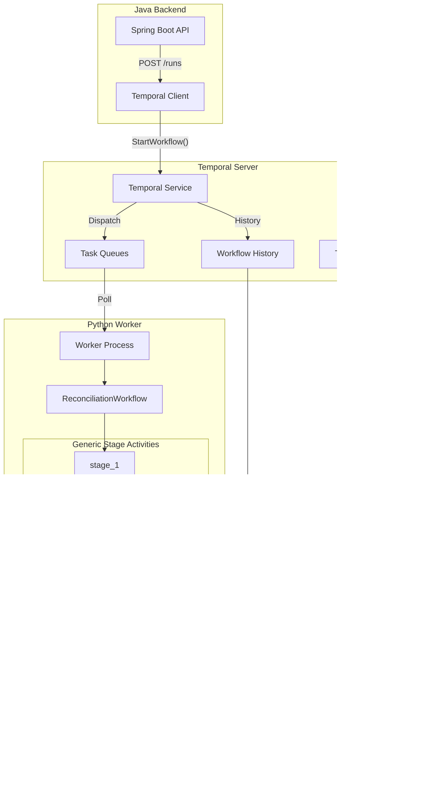

### 2.1 Component Responsibilities

| Component | Responsibility |
|-----------|---------------|
| **Java API** | Receives requests, starts Temporal workflows, queries status |
| **Temporal Server** | Manages workflow state, task queues, history persistence |
| **Python Worker** | Runs workflows and activities, executes Polars logic |
| **S3** | Stores intermediate results between stages, final outputs |
| **PostgreSQL** | Temporal's backend for workflow history (separate from app DB) |

## 3. Workflow Execution Flow

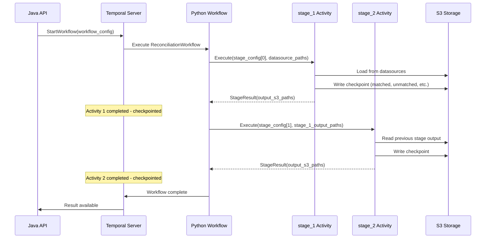

## 4. Resumability After Failure

Temporal automatically resumes workflows from the last checkpoint. Completed activities are **not re-executed**.

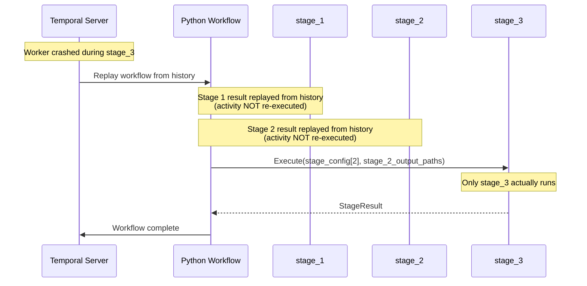

### 4.1 What Gets Re-executed vs Replayed

| Scenario | Behavior |
|----------|----------|
| Activity completed before crash | **Replayed** from history (no re-execution) |
| Activity in-progress during crash | **Re-executed** from beginning |
| Activity not yet started | **Executed** normally |

## 5. Stateful Workflows and S3 Checkpointing

### 5.1 The Problem

Reconciliation stages are **stateful** - they operate on in-memory Polars DataFrames. However, Temporal activities are designed to be **stateless**.

### 5.2 The Solution: S3 Checkpointing

Each stage writes its output to S3. The next stage reads from S3.

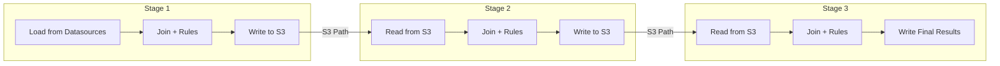

### 5.3 S3 Overhead Analysis

**Dataset**: 1 million rows × 64 bytes per row = 64 MB raw

| Metric | Value |
|--------|-------|
| Raw data size | 64 MB |
| Parquet compressed (~4x) | ~16 MB |
| S3 upload throughput | ~100-200 MB/s |
| S3 download throughput | ~100-200 MB/s |
| S3 request latency | ~50-100 ms |

**Per Stage Boundary Overhead**:

| Operation | Time |
|-----------|------|
| Upload 16 MB | ~0.1 sec |
| Download 16 MB | ~0.1 sec |
| Request latency (2 requests) | ~0.2 sec |
| **Total per boundary** | **~0.4 seconds** |

**For a 5-stage workflow** (4 stage boundaries):
- S3 overhead: ~1.6 seconds
- Actual stage processing: 10-60+ seconds per stage
- **Verdict**: Overhead is negligible compared to processing time

### 5.4 S3 Path Structure

```
s3://recon-results/
└── {run_id}/
    ├── stage_1/
    │   ├── matched.parquet
    │   ├── unmatched_left.parquet
    │   ├── unmatched_right.parquet
    │   ├── match_failed.parquet
    │   └── _metrics.json
    ├── stage_2/
    │   └── ...
    └── stage_N/
        └── ...
```

## 6. Generic Stage Activities

### 6.1 Why Pre-defined Activities?

Instead of a single dynamic `execute_stage` activity, we define **N pre-defined activities**:

- `stage_1(config, input_paths) → StageResult`
- `stage_2(config, input_paths) → StageResult`
- `stage_3(config, input_paths) → StageResult`
- ...
- `stage_10(config, input_paths) → StageResult`

**Benefits**:
- Temporal tracks each activity type separately in history
- Workflow can resume from the exact failed stage
- Clear activity boundaries in Temporal UI

### 6.2 Why 10 Stages?

| Reason | Explanation |
|--------|-------------|
| Typical usage | Most reconciliation workflows have 2-5 stages |
| Headroom | 10 provides room for complex multi-way reconciliations |
| Extensibility | Can be increased if needed by adding more activity definitions |

### 6.3 Activity Behavior

All `stage_N` activities share the same implementation:

1. Receive stage configuration and input paths
2. Load data (from datasource or previous stage S3 output)
3. Perform deduplication (if configured)
4. Execute JOIN on join conditions
5. Evaluate matching rules
6. Categorize results (matched, unmatched_left, unmatched_right, match_failed)
7. Write outputs to S3
8. Return S3 paths and metrics

## 7. Worker Configuration

### 8.1 Python Worker Settings

| Setting | Value | Rationale |
|---------|-------|-----------|
| `task_queue` | `"recon-stages"` | Single queue for all reconciliation work |
| `max_concurrent_activities` | 5 | Limit parallel stage executions per worker |
| `max_concurrent_workflows` | 10 | Limit parallel workflow orchestrations |
| `activity_heartbeat_timeout` | 5 minutes | Detect stuck activities |
| `activity_start_to_close_timeout` | 2 hours | Max time for a single stage |

### 8.2 Scaling

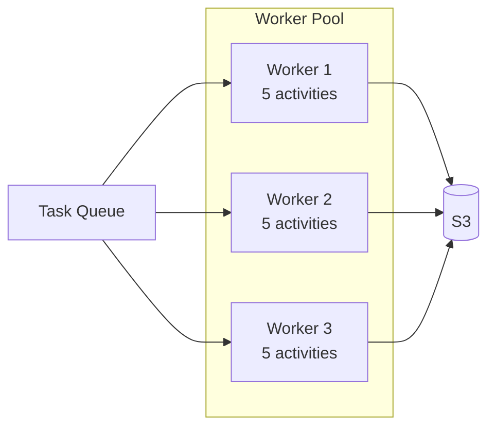

**System-wide concurrency**: 3 workers × 5 activities = **15 max parallel stages**

### 8.3 Auto-scaling with KEDA

Workers can be auto-scaled based on task queue depth:

| Trigger | Action |
|---------|--------|
| Queue depth > 3 per worker | Scale up |
| Queue empty for 5 minutes | Scale down |
| Minimum replicas | 1 |
| Maximum replicas | 10 |

## 8. Rate Limiting

### 8.1 System-Wide Rate Limiting

Controlled by worker pool size and `max_concurrent_activities`:

```
Total concurrent stages = Worker count × max_concurrent_activities
```

### 8.2 Per-Configuration Rate Limiting (Optional)

For configurations requiring dedicated limits:

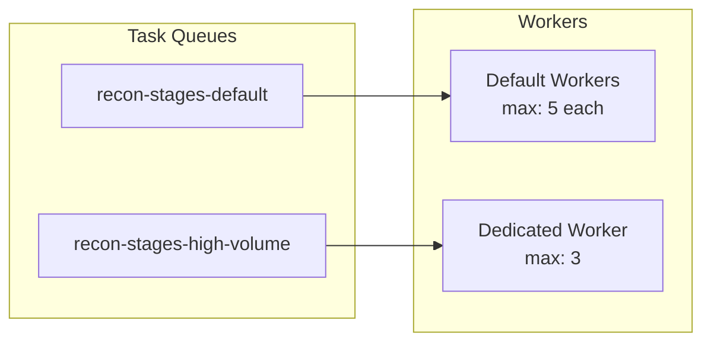

## 9. Error Handling and Retries

### 9.1 Retry Flow

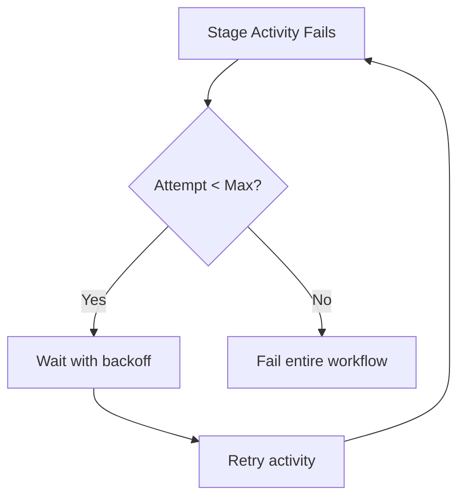

### 9.2 Retry Policy Settings

| Setting | Value | Behavior |
|---------|-------|----------|
| Maximum attempts | 3 | Total tries including first |
| Initial interval | 10 seconds | Wait before first retry |
| Backoff coefficient | 2.0 | Double wait each retry |
| Maximum interval | 5 minutes | Cap on retry wait time |
| Non-retryable errors | Configuration errors, validation errors | Fail immediately |

### 9.3 Heartbeat Behavior

Activities must send heartbeats during long operations. If heartbeats stop:

| Heartbeat timeout exceeded | Action |
|---------------------------|--------|
| Worker crashed | Temporal reschedules to another worker |
| Activity stuck | Temporal cancels and retries |

## 10. Monitoring and Visibility

### 10.1 Temporal Web UI

Provides built-in visibility without custom dashboards:

| Feature | Description |
|---------|-------------|
| Workflow list | Filter by status (running, completed, failed) |
| Workflow detail | Full event history, input/output |
| Activity timeline | Execution duration, retry attempts |
| Signal/Query interface | Send signals, run queries |

### 10.2 Workflow Queries

The Python workflow exposes queries for real-time status:

| Query | Returns |
|-------|---------|
| `get_status()` | Overall workflow status |
| `get_stage_statuses()` | Per-stage completion status and metrics |
| `get_current_stage()` | Currently executing stage |

### 10.3 Prometheus Metrics

Temporal SDK exports metrics automatically:

| Metric | Description |
|--------|-------------|
| `temporal_workflow_active_count` | Currently running workflows |
| `temporal_activity_execution_latency` | Activity duration histogram |
| `temporal_activity_execution_failed` | Failed activity count |
| `temporal_task_queue_backlog` | Pending tasks in queue |

## 11. Database Schema Changes

### 11.1 Tables to Remove

| Table | Reason |
|-------|--------|
| `job_queue` | Replaced by Temporal workflow history |
| `system_settings` | Rate limits now in worker config |

### 11.2 Updates to `runs` Table

| Change | Column | Reason |
|--------|--------|--------|
| **Add** | `temporal_workflow_id` | Link to Temporal workflow |
| **Add** | `temporal_run_id` | Specific run ID for retries |
| **Remove** | `k8s_job_name` | No longer using K8s Jobs |
| **Remove** | `k8s_pod_name` | No longer using K8s Jobs |
| **Remove** | `attempt` | Temporal tracks retries |
| **Remove** | `max_attempts` | Configured in retry policy |

## 12. API Integration

### 12.1 Starting a Reconciliation

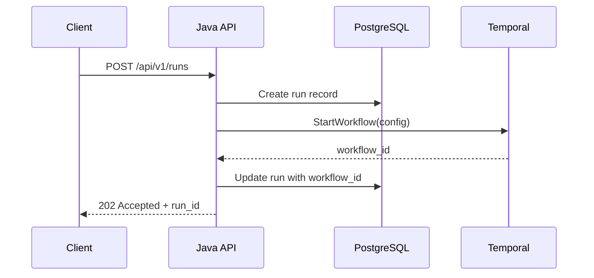

### 12.2 Querying Status

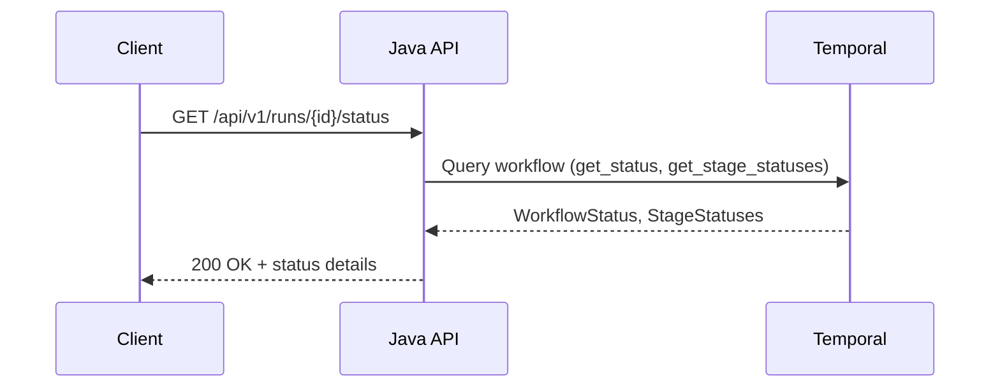

### 12.3 Cancelling a Run

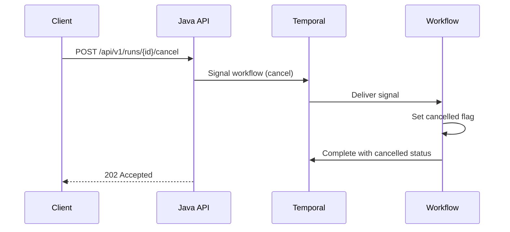

## 13. Deployment Architecture

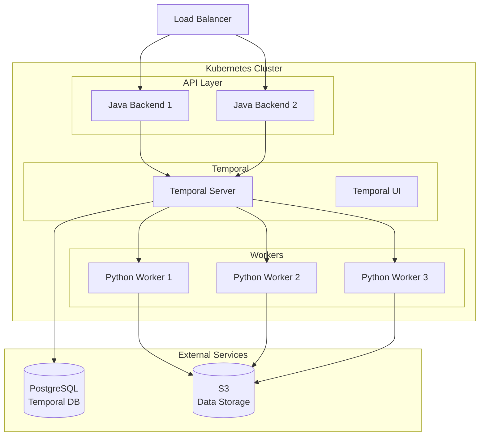

### 13.1 Component Deployment

| Component | Replicas | Resources | Notes |
|-----------|----------|-----------|-------|
| Temporal Server | 1 (or Temporal Cloud) | 2 CPU, 2 GB | Stateless, uses PostgreSQL |
| Temporal UI | 1 | 0.5 CPU, 512 MB | Web interface |
| Java Backend | 2+ | 1 CPU, 1 GB | API + Temporal client |
| Python Worker | 3+ (auto-scaled) | 4 CPU, 8 GB | Polars processing |

### 13.2 High Availability

| Component | HA Strategy |
|-----------|-------------|
| Temporal Server | Multiple replicas behind load balancer (or use Temporal Cloud) |
| Workers | Multiple replicas polling same task queue |
| PostgreSQL | Managed service with replicas (RDS, Cloud SQL) |
| S3 | AWS S3 (inherently highly available) |

## 14. Summary: Before and After

| Aspect | Before (PostgreSQL + K8s) | After (Temporal) |
|--------|--------------------------|------------------|
| **State storage** | `job_queue` table | Temporal workflow history |
| **Orchestration** | Java + K8s Jobs | Python workflow |
| **Rate limiting** | SQL COUNT queries | Worker concurrency |
| **Failure detection** | K8s Job watcher | Activity heartbeat |
| **Job completion** | HTTP callback | Activity completion |
| **Retries** | Manual state machine | Declarative policy |
| **Recovery** | Startup recovery code | Automatic |
| **Visibility** | Custom API + metrics | Temporal UI + queries |
| **Stage resumability** | None | S3 checkpoints + replay |
| **Code complexity** | ~500 lines | ~150 lines |

## 15. Future Enhancements

The following features are planned for future implementation:

| Enhancement | Description |
|-------------|-------------|
| **Parallel Stage Execution (DAG)** | Execute independent stages concurrently using `asyncio.gather`. Stages with the same `order` and no inter-dependencies can run in parallel, with results merged at synchronization points. |
| **Per-Configuration Task Queues** | Dedicated task queues and workers for high-volume configurations, enabling isolated rate limiting and resource allocation. |
| **Advanced Failure Policies** | `SKIP_DEPENDENTS` (skip downstream stages, continue other branches) and `CONTINUE` (log failure, continue all branches) policies for DAG workflows. |
