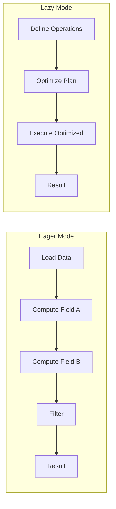

# Expression Engine Deep Analysis: (Go/Rust + Lua) vs Polars

## 1. Overview

This document provides detailed technical analysis comparing two approaches for the reconciliation expression engine:
1. **Go/Rust + Lua**: A Go or Rust application with embedded Lua scripting for rule evaluation
2. **Polars**: Python-based data processing using Polars expressions

The comparison covers:
- Expression capabilities and rule building
- Lazy evaluation and derived fields
- Schema normalization
- Result querying

**Note**: In the Go/Rust + Lua approach, the host language (Go/Rust) handles data loading, schema management, and orchestration, while Lua handles flexible rule evaluation. This is not Lua running standalone.

---

## 2. Expression Capability Comparison

### 2.1 Supported Operations

| Operation Type | Polars | Go/Rust + Lua | Notes |
|----------------|--------|---------------|-------|
| **Arithmetic** | `+`, `-`, `*`, `/`, `%`, `//` | `+`, `-`, `*`, `/`, `%` | Polars has floor division |
| **Comparison** | `==`, `!=`, `>`, `<`, `>=`, `<=` | `==`, `~=`, `>`, `<`, `>=`, `<=` | Lua uses `~=` for not equal |
| **Boolean** | `&`, `\|`, `~` | `and`, `or`, `not` | Polars uses bitwise operators |
| **String** | 50+ methods | Go/Rust stdlib + Lua helpers | Go/Rust can pre-process; Lua for rules |
| **DateTime** | 30+ methods | Go/Rust stdlib + Lua helpers | Go/Rust can handle parsing; Lua for comparisons |
| **Null Handling** | Native | Go/Rust handles defaults; Lua manual | Pre-process nulls in host language |
| **Regex** | Native | Go/Rust regex + Lua patterns | Full regex available in Go/Rust |
| **List/Array** | Native | Go/Rust slices + Lua tables | Polars has richer list operations |
| **Aggregation** | Native | Go/Rust computes | Polars has `sum`, `mean`, etc. natively |
| **Window Functions** | Native | Go/Rust implementation | Polars has `over()` built-in |

### 2.2 String Operations

#### Polars String Expressions

```python
import polars as pl

# Rich string operations
expr = (
    pl.col("name")
    .str.to_uppercase()
    .str.strip_chars()
    .str.replace_all(r"\s+", " ")
    .str.slice(0, 50)
)

# Pattern matching
expr = pl.col("reference").str.contains(r"^TXN-\d{6}$")

# String similarity (fuzzy matching)
expr = pl.col("name_a").str.to_lowercase() == pl.col("name_b").str.to_lowercase()

# Extract with regex
expr = pl.col("description").str.extract(r"Amount: \$(\d+\.\d{2})", 1)

# Split and access
expr = pl.col("full_name").str.split(" ").list.first()
```

#### Go/Rust + Lua String Operations

```lua
-- Lua helper functions (can also be pre-computed by Go/Rust host)
local StringOps = {
    upper = function(s) return string.upper(s or "") end,
    lower = function(s) return string.lower(s or "") end,
    trim = function(s) return (s or ""):match("^%s*(.-)%s*$") end,
    contains = function(s, pattern) return string.find(s or "", pattern) ~= nil end,
    replace = function(s, pattern, replacement)
        return string.gsub(s or "", pattern, replacement)
    end,
    slice = function(s, start, length)
        return string.sub(s or "", start, start + length - 1)
    end,
    -- Regex requires external library (lrexlib) or Lua patterns (limited)
    match = function(s, pattern)
        return string.match(s or "", pattern)
    end
}

-- Usage in rule
function evaluate(left, right)
    local name_a = StringOps.trim(StringOps.lower(left.name))
    local name_b = StringOps.trim(StringOps.lower(right.name))
    return name_a == name_b
end
```

**Verdict**: Polars has significantly richer string operations out of the box. In Go/Rust + Lua, the host language can pre-process strings (normalization, regex extraction) before passing to Lua for rule evaluation, providing equivalent capability with more implementation effort.

### 2.3 DateTime Operations

#### Polars DateTime Expressions

```python
import polars as pl

# Parse datetime
expr = pl.col("date_str").str.strptime(pl.Datetime, "%Y-%m-%d %H:%M:%S")

# Extract components
expr = pl.col("timestamp").dt.year()
expr = pl.col("timestamp").dt.month()
expr = pl.col("timestamp").dt.day()
expr = pl.col("timestamp").dt.hour()
expr = pl.col("timestamp").dt.weekday()
expr = pl.col("timestamp").dt.quarter()

# Date arithmetic
expr = pl.col("date_a") - pl.col("date_b")  # Returns Duration
expr = (pl.col("date_a") - pl.col("date_b")).dt.total_days()
expr = (pl.col("date_a") - pl.col("date_b")).dt.total_hours()

# Date manipulation
expr = pl.col("date").dt.truncate("1d")  # Truncate to day
expr = pl.col("date").dt.offset_by("7d")  # Add 7 days
expr = pl.col("date").dt.month_start()
expr = pl.col("date").dt.month_end()

# Business day calculations (with plugin)
# expr = pl.col("date").business_day.advance(5)

# Complex example: dates within 3 business days
rule = (
    (pl.col("date_a") - pl.col("date_b")).dt.total_days().abs() <= 3
)
```

#### Go/Rust + Lua DateTime Operations

```lua
-- DateTime utilities (must implement)
local DateTime = {
    -- Parse ISO date string to timestamp
    parse = function(date_str)
        if not date_str then return nil end
        local pattern = "(%d+)-(%d+)-(%d+)"
        local year, month, day = date_str:match(pattern)
        if not year then return nil end
        return os.time({year=year, month=month, day=day})
    end,

    -- Parse datetime string
    parse_datetime = function(dt_str)
        if not dt_str then return nil end
        local pattern = "(%d+)-(%d+)-(%d+) (%d+):(%d+):(%d+)"
        local y, m, d, h, min, s = dt_str:match(pattern)
        if not y then return nil end
        return os.time({year=y, month=m, day=d, hour=h, min=min, sec=s})
    end,

    -- Days between two dates
    days_between = function(date1, date2)
        local t1 = DateTime.parse(date1)
        local t2 = DateTime.parse(date2)
        if not t1 or not t2 then return nil end
        return math.floor(math.abs(t2 - t1) / 86400)
    end,

    -- Hours between two datetimes
    hours_between = function(dt1, dt2)
        local t1 = DateTime.parse_datetime(dt1)
        local t2 = DateTime.parse_datetime(dt2)
        if not t1 or not t2 then return nil end
        return math.floor(math.abs(t2 - t1) / 3600)
    end,

    -- Extract year
    year = function(date_str)
        return tonumber(date_str:match("^(%d+)"))
    end,

    -- Extract month
    month = function(date_str)
        return tonumber(date_str:match("^%d+-(%d+)"))
    end,

    -- Add days
    add_days = function(date_str, days)
        local t = DateTime.parse(date_str)
        if not t then return nil end
        return os.date("%Y-%m-%d", t + days * 86400)
    end
}

-- Usage in rule
function evaluate(left, right)
    local days = DateTime.days_between(left.txn_date, right.txn_date)
    return days ~= nil and days <= 3
end
```

**Verdict**: Polars has comprehensive datetime support built-in. In Go/Rust + Lua, the host language can handle datetime parsing, timezone conversion, and complex date arithmetic, passing pre-computed values (timestamps, day counts) to Lua for rule evaluation.

### 2.4 Null/Missing Value Handling

#### Polars Null Handling

```python
import polars as pl

# Check for null
expr = pl.col("amount").is_null()
expr = pl.col("amount").is_not_null()

# Fill null with value
expr = pl.col("amount").fill_null(0)
expr = pl.col("amount").fill_null(pl.lit(0))

# Fill null with strategy
expr = pl.col("amount").fill_null(strategy="forward")
expr = pl.col("amount").fill_null(strategy="mean")

# Coalesce (first non-null)
expr = pl.coalesce(pl.col("primary_id"), pl.col("secondary_id"), pl.col("fallback_id"))

# Drop nulls in aggregation
expr = pl.col("amount").drop_nulls().sum()

# Null-safe comparison
expr = pl.col("a").eq_missing(pl.col("b"))  # null == null is True
```

#### Go/Rust + Lua Null Handling

```lua
-- Null utilities
local Null = {
    -- Check if nil
    is_null = function(v)
        return v == nil
    end,

    -- Coalesce
    coalesce = function(...)
        for _, v in ipairs({...}) do
            if v ~= nil then return v end
        end
        return nil
    end,

    -- Fill null with default
    fill_null = function(v, default)
        if v == nil then return default end
        return v
    end,

    -- Null-safe equals
    eq = function(a, b)
        if a == nil and b == nil then return true end
        if a == nil or b == nil then return false end
        return a == b
    end
}

-- Usage in rule
function evaluate(left, right)
    local id_a = Null.coalesce(left.primary_id, left.secondary_id, left.alt_id)
    local id_b = Null.coalesce(right.primary_id, right.secondary_id, right.alt_id)
    return Null.eq(id_a, id_b)
end
```

**Verdict**: Polars has first-class null handling with multiple strategies. In Go/Rust + Lua, null handling can be performed at the Go/Rust layer during data loading/normalization, with Lua receiving already-sanitized values or explicit null markers.

### 2.5 Complex Expression Examples

#### Example 1: Multi-field Fuzzy Matching

**Polars:**
```python
# Match if: same currency AND (exact amount OR within 1% tolerance) AND dates within 3 days
rule = (
    (pl.col("currency") == pl.col("currency_right")) &
    (
        (pl.col("amount") == pl.col("amount_right")) |
        (
            (pl.col("amount") - pl.col("amount_right")).abs() /
            pl.max_horizontal(pl.col("amount"), pl.col("amount_right"))
        ) <= 0.01
    ) &
    ((pl.col("date") - pl.col("date_right")).dt.total_days().abs() <= 3)
)
```

**Lua:**
```lua
function evaluate(left, right)
    -- Currency match
    local currency_match = left.currency == right.currency
    if not currency_match then return false end

    -- Amount match (exact or within 1%)
    local amount_exact = left.amount == right.amount
    local amount_tolerance = false
    if not amount_exact then
        local diff = math.abs(left.amount - right.amount)
        local max_amount = math.max(left.amount, right.amount)
        if max_amount > 0 then
            amount_tolerance = (diff / max_amount) <= 0.01
        end
    end
    local amount_match = amount_exact or amount_tolerance
    if not amount_match then return false end

    -- Date within 3 days
    local days = DateTime.days_between(left.date, right.date)
    local date_match = days ~= nil and days <= 3

    return date_match
end
```

#### Example 2: Conditional Logic with Multiple Paths

**Polars:**
```python
# Different matching logic based on transaction type
rule = pl.when(
    pl.col("txn_type") == "WIRE"
).then(
    # Wire transfers: exact match required
    (pl.col("amount") == pl.col("amount_right")) &
    (pl.col("reference") == pl.col("reference_right"))
).when(
    pl.col("txn_type") == "ACH"
).then(
    # ACH: tolerance allowed, reference partial match
    ((pl.col("amount") - pl.col("amount_right")).abs() <= 0.50) &
    (pl.col("reference").str.contains(pl.col("reference_right").str.slice(0, 8)))
).otherwise(
    # Default: amount tolerance only
    (pl.col("amount") - pl.col("amount_right")).abs() <= 1.00
)
```

**Lua:**
```lua
function evaluate(left, right)
    if left.txn_type == "WIRE" then
        -- Wire: exact match
        return left.amount == right.amount and
               left.reference == right.reference

    elseif left.txn_type == "ACH" then
        -- ACH: tolerance + partial reference
        local amount_ok = math.abs(left.amount - right.amount) <= 0.50
        local ref_prefix = string.sub(right.reference or "", 1, 8)
        local ref_ok = string.find(left.reference or "", ref_prefix, 1, true) ~= nil
        return amount_ok and ref_ok

    else
        -- Default: amount tolerance
        return math.abs(left.amount - right.amount) <= 1.00
    end
end
```

**Verdict**: Both can express complex conditional logic. Polars is more declarative; Go/Rust + Lua is more imperative but potentially clearer for complex branching. The Lua code benefits from having pre-computed derived fields from the Go/Rust host.

---

## 3. Lazy Evaluation and Derived Fields

### 3.1 What is Lazy Evaluation?

Lazy evaluation defers computation until results are actually needed, enabling:
- Query optimization (predicate pushdown, projection pruning)
- Memory efficiency (don't materialize intermediate results)
- Derived field computation only when accessed

### 3.2 Polars Lazy Evaluation



#### Polars LazyFrame Example

```python
import polars as pl

# Define schema with derived fields lazily
df = pl.scan_csv("transactions.csv")  # Returns LazyFrame, doesn't load yet

# Define derived fields (not computed yet)
df = df.with_columns([
    # Derived: normalized amount (expensive computation)
    (pl.col("amount") / pl.col("exchange_rate")).alias("amount_usd"),

    # Derived: parsed date
    pl.col("date_str").str.strptime(pl.Date, "%Y-%m-%d").alias("txn_date"),

    # Derived: cleaned reference
    pl.col("reference")
        .str.strip_chars()
        .str.to_uppercase()
        .str.replace_all(r"[^A-Z0-9]", "")
        .alias("clean_reference"),

    # Derived: transaction category
    pl.when(pl.col("amount") > 10000)
        .then(pl.lit("HIGH_VALUE"))
        .when(pl.col("amount") > 1000)
        .then(pl.lit("MEDIUM_VALUE"))
        .otherwise(pl.lit("LOW_VALUE"))
        .alias("value_category")
])

# Filter (optimizer will push this down)
df = df.filter(pl.col("status") == "COMPLETED")

# Select only needed columns (projection pruning)
df = df.select(["txn_id", "amount_usd", "clean_reference", "txn_date"])

# NOW execute - only computes what's needed
result = df.collect()
```

#### Polars Query Optimization

```python
# View the optimized query plan
print(df.explain(optimized=True))

# Output shows:
# - Predicate pushdown: filter moved before expensive operations
# - Projection pruning: only required columns loaded
# - Common subexpression elimination
```

### 3.3 Go/Rust + Lua Evaluation

In the Go/Rust + Lua approach, Go/Rust handles data loading and can implement lazy evaluation strategies at the host level. Lua evaluates expressions eagerly when called, but the host controls when and what data is passed to Lua.

#### Option 1: Go/Rust Pre-computes All Derived Fields

```lua
-- Go/Rust normalizes record by computing all derived fields before passing to Lua
-- This shows the Lua-side view of pre-computed data
function normalize_record(record)
    return {
        -- Original fields
        txn_id = record.txn_id,
        amount = record.amount,
        currency = record.currency,
        reference = record.reference,
        date_str = record.date_str,

        -- Derived fields (always computed)
        amount_usd = record.amount / (record.exchange_rate or 1),
        txn_date = DateTime.parse(record.date_str),
        clean_reference = StringOps.upper(StringOps.trim(record.reference or "")),
        value_category = (
            record.amount > 10000 and "HIGH_VALUE" or
            record.amount > 1000 and "MEDIUM_VALUE" or
            "LOW_VALUE"
        )
    }
end

-- Usage: compute all derived fields for every record
for _, record in ipairs(records) do
    local normalized = normalize_record(record)
    -- ... use normalized record
end
```

#### Option 2: Lazy Field Access (Go/Rust callbacks or Lua Metatables)

```lua
-- Create a lazy record wrapper using metatables
function create_lazy_record(raw_record, schema)
    local cache = {}  -- Cache computed values

    local lazy = setmetatable({}, {
        __index = function(t, field)
            -- Return cached value if exists
            if cache[field] ~= nil then
                return cache[field]
            end

            -- Check if it's a raw field
            if raw_record[field] ~= nil then
                return raw_record[field]
            end

            -- Check if it's a derived field
            local derivation = schema.derived_fields[field]
            if derivation then
                -- Compute and cache
                local value = derivation.compute(raw_record, t)
                cache[field] = value
                return value
            end

            return nil
        end
    })

    return lazy
end

-- Define schema with derived field computations
local schema = {
    derived_fields = {
        amount_usd = {
            compute = function(raw, lazy)
                return raw.amount / (raw.exchange_rate or 1)
            end
        },
        txn_date = {
            compute = function(raw, lazy)
                return DateTime.parse(raw.date_str)
            end
        },
        clean_reference = {
            compute = function(raw, lazy)
                return StringOps.upper(StringOps.trim(raw.reference or ""))
            end
        },
        value_category = {
            compute = function(raw, lazy)
                if raw.amount > 10000 then return "HIGH_VALUE"
                elseif raw.amount > 1000 then return "MEDIUM_VALUE"
                else return "LOW_VALUE"
                end
            end
        }
    }
}

-- Usage: derived fields computed only when accessed
local lazy_record = create_lazy_record(raw_record, schema)
print(lazy_record.txn_id)           -- Direct access, no computation
print(lazy_record.amount_usd)       -- Computed on first access
print(lazy_record.amount_usd)       -- Returns cached value
```

### 3.4 Lazy Evaluation Comparison

| Aspect | Polars | Go/Rust + Lua (Eager) | Go/Rust + Lua (Lazy) |
|--------|--------|------------------------|----------------------|
| **Query Optimization** | Automatic | Go/Rust can optimize data loading | Go/Rust can implement |
| **Predicate Pushdown** | Yes | Go/Rust can filter before Lua | Go/Rust can implement |
| **Projection Pruning** | Yes | Go/Rust selects fields to pass | Go/Rust can implement |
| **Derived Field Computation** | Only if needed | Go/Rust decides what to compute | On access via callbacks |
| **Caching** | Automatic | Go/Rust level caching | Go/Rust + Lua caching |
| **Memory Efficiency** | Excellent | Good (Go/Rust controlled) | Good |
| **Implementation Effort** | Zero | Medium | High |
| **Debugging** | Query plan visible | Go/Rust tooling + Lua traces | More complex |

### 3.5 Performance Impact

```mermaid
flowchart TD
    subgraph Polars["Polars: 1M Records"]
        P1["Load CSV<br/>~500ms"] --> P2["Compute 10 derived fields<br/>(only 3 needed)"]
        P2 --> P3["Filter<br/>(pushed to load)"]
        P3 --> P4["Result<br/>Total: ~800ms"]
    end

    subgraph GoRustLuaEager["Go/Rust + Lua (Eager): 1M Records"]
        L1["Go/Rust Load CSV<br/>~300ms"] --> L2["Go/Rust Compute ALL 10 derived<br/>~800ms"]
        L2 --> L3["Lua Rule Evaluation<br/>~400ms"]
        L3 --> L4["Result<br/>Total: ~1500ms"]
    end

    subgraph GoRustLuaLazy["Go/Rust + Lua (Smart): 1M Records"]
        LL1["Go/Rust Load CSV<br/>~300ms"] --> LL2["Go/Rust Compute 3 needed<br/>~250ms"]
        LL2 --> LL3["Lua Rule Evaluation<br/>~400ms"]
        LL3 --> LL4["Result<br/>Total: ~950ms"]
    end
```



**Note**: Go/Rust has fast CSV parsing (e.g., using `csv` crate in Rust or efficient Go parsers). The host language can analyze which fields rules actually need and compute only those.

---

## 4. Schema Normalization

### 4.1 What is Schema Normalization?

Schema normalization transforms raw data into a consistent format:
- Field renaming (mapping source fields to canonical names)
- Type conversion (string → date, string → number)
- Value transformation (currency conversion, unit normalization)
- Derived field computation

### 4.2 Polars Schema Normalization

```python
import polars as pl
from typing import Dict, Any

def normalize_schema(
    df: pl.LazyFrame,
    schema_config: Dict[str, Any]
) -> pl.LazyFrame:
    """
    Apply schema normalization based on configuration.
    """
    expressions = []

    for field_config in schema_config["fields"]:
        source_field = field_config["source_field"]
        target_field = field_config["target_field"]
        field_type = field_config.get("type", "string")

        # Start with source column
        expr = pl.col(source_field)

        # Apply type conversion
        if field_type == "decimal":
            expr = expr.cast(pl.Float64)
        elif field_type == "integer":
            expr = expr.cast(pl.Int64)
        elif field_type == "date":
            format_str = field_config.get("format", "%Y-%m-%d")
            expr = expr.str.strptime(pl.Date, format_str)
        elif field_type == "datetime":
            format_str = field_config.get("format", "%Y-%m-%d %H:%M:%S")
            expr = expr.str.strptime(pl.Datetime, format_str)
        elif field_type == "boolean":
            true_values = field_config.get("true_values", ["true", "1", "yes"])
            expr = expr.str.to_lowercase().is_in(true_values)

        # Apply transformations
        for transform in field_config.get("transforms", []):
            if transform["type"] == "uppercase":
                expr = expr.str.to_uppercase()
            elif transform["type"] == "lowercase":
                expr = expr.str.to_lowercase()
            elif transform["type"] == "trim":
                expr = expr.str.strip_chars()
            elif transform["type"] == "replace":
                expr = expr.str.replace_all(transform["pattern"], transform["replacement"])
            elif transform["type"] == "multiply":
                expr = expr * transform["factor"]
            elif transform["type"] == "divide":
                expr = expr / transform["divisor"]
            elif transform["type"] == "default":
                expr = expr.fill_null(transform["value"])

        # Rename to target field
        expr = expr.alias(target_field)
        expressions.append(expr)

    # Add derived fields
    for derived in schema_config.get("derived_fields", []):
        expr = build_derived_expression(derived, schema_config)
        expressions.append(expr)

    return df.select(expressions)


def build_derived_expression(derived_config: Dict, schema_config: Dict) -> pl.Expr:
    """Build Polars expression for derived field."""
    expr_type = derived_config["expression"]["type"]

    if expr_type == "concat":
        fields = [pl.col(f) for f in derived_config["expression"]["fields"]]
        separator = derived_config["expression"].get("separator", "")
        expr = pl.concat_str(fields, separator=separator)

    elif expr_type == "arithmetic":
        op = derived_config["expression"]["operator"]
        left = pl.col(derived_config["expression"]["left"])
        right = derived_config["expression"]["right"]
        if isinstance(right, str):
            right = pl.col(right)
        else:
            right = pl.lit(right)

        if op == "+": expr = left + right
        elif op == "-": expr = left - right
        elif op == "*": expr = left * right
        elif op == "/": expr = left / right

    elif expr_type == "conditional":
        conditions = derived_config["expression"]["conditions"]
        expr = pl.lit(derived_config["expression"].get("default"))
        for cond in reversed(conditions):
            condition_expr = build_condition(cond["when"])
            expr = pl.when(condition_expr).then(pl.lit(cond["then"])).otherwise(expr)

    return expr.alias(derived_config["name"])


# Example schema configuration
schema_config = {
    "fields": [
        {
            "source_field": "TXN_ID",
            "target_field": "transaction_id",
            "type": "string",
            "transforms": [{"type": "trim"}, {"type": "uppercase"}]
        },
        {
            "source_field": "AMT",
            "target_field": "amount",
            "type": "decimal",
            "transforms": [{"type": "default", "value": 0}]
        },
        {
            "source_field": "TXN_DATE",
            "target_field": "date",
            "type": "date",
            "format": "%m/%d/%Y"
        },
        {
            "source_field": "CCY",
            "target_field": "currency",
            "type": "string",
            "transforms": [{"type": "uppercase"}, {"type": "trim"}]
        }
    ],
    "derived_fields": [
        {
            "name": "amount_usd",
            "expression": {
                "type": "arithmetic",
                "operator": "/",
                "left": "amount",
                "right": "exchange_rate"
            }
        },
        {
            "name": "value_tier",
            "expression": {
                "type": "conditional",
                "conditions": [
                    {"when": {"field": "amount", "operator": ">", "value": 10000}, "then": "HIGH"},
                    {"when": {"field": "amount", "operator": ">", "value": 1000}, "then": "MEDIUM"}
                ],
                "default": "LOW"
            }
        }
    ]
}

# Apply normalization
raw_df = pl.scan_csv("source_data.csv")
normalized_df = normalize_schema(raw_df, schema_config)
```

### 4.3 Go/Rust + Lua Schema Normalization

In the Go/Rust + Lua approach, schema normalization is typically handled by the Go/Rust host, with Lua receiving already-normalized data. Below shows Lua helpers for cases where normalization logic needs to be in Lua:

```lua
-- Schema normalization helpers (typically handled by Go/Rust host)

local SchemaNormalizer = {}

-- Type converters
local TypeConverters = {
    string = function(value)
        if value == nil then return nil end
        return tostring(value)
    end,

    decimal = function(value)
        if value == nil then return nil end
        return tonumber(value)
    end,

    integer = function(value)
        if value == nil then return nil end
        local n = tonumber(value)
        return n and math.floor(n) or nil
    end,

    date = function(value, format)
        if value == nil then return nil end
        -- Simple date parsing (would need expansion for different formats)
        return DateTime.parse(value)
    end,

    boolean = function(value, config)
        if value == nil then return nil end
        local true_values = config.true_values or {"true", "1", "yes"}
        local lower = string.lower(tostring(value))
        for _, tv in ipairs(true_values) do
            if lower == tv then return true end
        end
        return false
    end
}

-- Transform functions
local Transforms = {
    uppercase = function(value)
        return value and string.upper(value) or nil
    end,

    lowercase = function(value)
        return value and string.lower(value) or nil
    end,

    trim = function(value)
        if not value then return nil end
        return value:match("^%s*(.-)%s*$")
    end,

    replace = function(value, config)
        if not value then return nil end
        return string.gsub(value, config.pattern, config.replacement)
    end,

    multiply = function(value, config)
        if not value then return nil end
        return value * config.factor
    end,

    divide = function(value, config)
        if not value then return nil end
        return value / config.divisor
    end,

    default = function(value, config)
        if value == nil then return config.value end
        return value
    end
}

-- Normalize a single field
function SchemaNormalizer.normalize_field(value, field_config)
    -- Apply type conversion
    local converter = TypeConverters[field_config.type or "string"]
    local result = converter(value, field_config)

    -- Apply transforms
    for _, transform in ipairs(field_config.transforms or {}) do
        local transform_fn = Transforms[transform.type]
        if transform_fn then
            result = transform_fn(result, transform)
        end
    end

    return result
end

-- Build derived field value
function SchemaNormalizer.compute_derived(record, derived_config)
    local expr = derived_config.expression

    if expr.type == "concat" then
        local parts = {}
        for _, field in ipairs(expr.fields) do
            table.insert(parts, tostring(record[field] or ""))
        end
        return table.concat(parts, expr.separator or "")

    elseif expr.type == "arithmetic" then
        local left = record[expr.left]
        local right = type(expr.right) == "string" and record[expr.right] or expr.right
        if left == nil or right == nil then return nil end

        if expr.operator == "+" then return left + right
        elseif expr.operator == "-" then return left - right
        elseif expr.operator == "*" then return left * right
        elseif expr.operator == "/" then return left / right
        end

    elseif expr.type == "conditional" then
        for _, cond in ipairs(expr.conditions) do
            local field_value = record[cond["when"].field]
            local test_value = cond["when"].value
            local op = cond["when"].operator

            local matches = false
            if op == "=" or op == "==" then matches = field_value == test_value
            elseif op == "!=" then matches = field_value ~= test_value
            elseif op == ">" then matches = field_value > test_value
            elseif op == ">=" then matches = field_value >= test_value
            elseif op == "<" then matches = field_value < test_value
            elseif op == "<=" then matches = field_value <= test_value
            end

            if matches then return cond["then"] end
        end
        return expr.default
    end

    return nil
end

-- Normalize entire record
function SchemaNormalizer.normalize_record(raw_record, schema_config)
    local normalized = {}

    -- Normalize defined fields
    for _, field_config in ipairs(schema_config.fields) do
        local source_value = raw_record[field_config.source_field]
        local target_value = SchemaNormalizer.normalize_field(source_value, field_config)
        normalized[field_config.target_field] = target_value
    end

    -- Compute derived fields
    for _, derived_config in ipairs(schema_config.derived_fields or {}) do
        normalized[derived_config.name] = SchemaNormalizer.compute_derived(normalized, derived_config)
    end

    return normalized
end

-- Create lazy normalizer (computes on access)
function SchemaNormalizer.create_lazy(raw_record, schema_config)
    local cache = {}
    local field_map = {}

    -- Build field lookup
    for _, fc in ipairs(schema_config.fields) do
        field_map[fc.target_field] = fc
    end

    local derived_map = {}
    for _, dc in ipairs(schema_config.derived_fields or {}) do
        derived_map[dc.name] = dc
    end

    return setmetatable({}, {
        __index = function(t, field)
            -- Return cached
            if cache[field] ~= nil then return cache[field] end

            -- Normalize field on access
            if field_map[field] then
                local fc = field_map[field]
                cache[field] = SchemaNormalizer.normalize_field(
                    raw_record[fc.source_field], fc
                )
                return cache[field]
            end

            -- Compute derived on access
            if derived_map[field] then
                -- Need to access dependencies first
                cache[field] = SchemaNormalizer.compute_derived(t, derived_map[field])
                return cache[field]
            end

            return nil
        end
    })
end

return SchemaNormalizer
```

### 4.4 Schema Normalization Comparison

| Feature | Polars | Go/Rust + Lua |
|---------|--------|---------------|
| **Declarative Config** | Yes | Yes (Go/Rust parses config) |
| **Type Conversion** | Built-in | Go/Rust stdlib |
| **Null Handling** | Native | Go/Rust handles before Lua |
| **Transform Pipeline** | Native | Go/Rust implementation |
| **Lazy Evaluation** | Automatic | Go/Rust can implement |
| **Vectorized** | Yes (fast) | Go/Rust can batch process |
| **Error Handling** | Built-in | Go/Rust error handling |
| **Validation** | Schema-based | Go/Rust struct validation |
| **Single Binary** | No (Python) | Yes |

---

## 5. Rules Querying (Result Queries)

### 5.1 What are Result Queries?

Result queries filter reconciliation results for:
- Downstream stages (use matched/unmatched from previous stage)
- Reports (high-value mismatches, specific error categories)
- Alerts (flagged transactions)

### 5.2 Polars Result Queries

```python
import polars as pl

class ResultQueryEngine:
    def __init__(self, results_df: pl.LazyFrame):
        self.results = results_df

    def query(self, query_config: dict) -> pl.LazyFrame:
        """Execute a result query based on configuration."""
        df = self.results

        # Apply filter
        if "filter" in query_config:
            filter_expr = self.build_filter_expression(query_config["filter"])
            df = df.filter(filter_expr)

        # Apply grouping
        if "group_by" in query_config:
            group_cols = query_config["group_by"]
            agg_exprs = []
            for agg in query_config.get("aggregations", []):
                agg_exprs.append(self.build_aggregation(agg))
            df = df.group_by(group_cols).agg(agg_exprs)

        # Apply sorting
        if "order_by" in query_config:
            sort_cols = []
            descending = []
            for sort in query_config["order_by"]:
                sort_cols.append(sort["field"])
                descending.append(sort.get("descending", False))
            df = df.sort(sort_cols, descending=descending)

        # Apply limit
        if "limit" in query_config:
            df = df.limit(query_config["limit"])

        return df

    def build_filter_expression(self, filter_config: dict) -> pl.Expr:
        """Build Polars filter expression from config."""
        if filter_config["type"] == "comparison":
            left = self.build_value_expr(filter_config["left"])
            right = self.build_value_expr(filter_config["right"])
            op = filter_config["operator"]

            if op == "=": return left == right
            elif op == "!=": return left != right
            elif op == ">": return left > right
            elif op == ">=": return left >= right
            elif op == "<": return left < right
            elif op == "<=": return left <= right
            elif op == "in": return left.is_in(right)
            elif op == "contains": return left.str.contains(right)
            elif op == "is_null": return left.is_null()
            elif op == "is_not_null": return left.is_not_null()

        elif filter_config["type"] == "boolean":
            children = [self.build_filter_expression(c) for c in filter_config["children"]]
            if filter_config["operator"] == "AND":
                return pl.all_horizontal(children)
            elif filter_config["operator"] == "OR":
                return pl.any_horizontal(children)
            elif filter_config["operator"] == "NOT":
                return ~children[0]

        return pl.lit(True)

    def build_value_expr(self, value_config) -> pl.Expr:
        """Build value expression."""
        if isinstance(value_config, dict):
            if value_config.get("type") == "field":
                return pl.col(value_config["name"])
            elif value_config.get("type") == "literal":
                return pl.lit(value_config["value"])
        return pl.lit(value_config)

    def build_aggregation(self, agg_config: dict) -> pl.Expr:
        """Build aggregation expression."""
        field = pl.col(agg_config["field"])
        func = agg_config["function"]
        alias = agg_config.get("alias", f"{func}_{agg_config['field']}")

        if func == "count": return field.count().alias(alias)
        elif func == "sum": return field.sum().alias(alias)
        elif func == "avg": return field.mean().alias(alias)
        elif func == "min": return field.min().alias(alias)
        elif func == "max": return field.max().alias(alias)
        elif func == "first": return field.first().alias(alias)
        elif func == "last": return field.last().alias(alias)


# Example queries
query_engine = ResultQueryEngine(results_df)

# Query 1: High-value unmatched transactions
high_value_unmatched = query_engine.query({
    "filter": {
        "type": "boolean",
        "operator": "AND",
        "children": [
            {"type": "comparison", "left": {"type": "field", "name": "result"}, "operator": "=", "right": {"type": "literal", "value": "UNMATCHED_LEFT"}},
            {"type": "comparison", "left": {"type": "field", "name": "amount"}, "operator": ">", "right": {"type": "literal", "value": 10000}}
        ]
    },
    "order_by": [{"field": "amount", "descending": True}],
    "limit": 100
})

# Query 2: Match failures grouped by reason
failures_by_reason = query_engine.query({
    "filter": {
        "type": "comparison",
        "left": {"type": "field", "name": "result"},
        "operator": "=",
        "right": {"type": "literal", "value": "MATCH_FAILED"}
    },
    "group_by": ["failure_reason"],
    "aggregations": [
        {"field": "transaction_id", "function": "count", "alias": "count"},
        {"field": "amount", "function": "sum", "alias": "total_amount"}
    ],
    "order_by": [{"field": "count", "descending": True}]
})

# Query 3: Transactions for specific date range
date_range_query = query_engine.query({
    "filter": {
        "type": "boolean",
        "operator": "AND",
        "children": [
            {"type": "comparison", "left": {"type": "field", "name": "date"}, "operator": ">=", "right": {"type": "literal", "value": "2024-01-01"}},
            {"type": "comparison", "left": {"type": "field", "name": "date"}, "operator": "<", "right": {"type": "literal", "value": "2024-02-01"}}
        ]
    }
})
```

### 5.3 Go/Rust + Lua Result Queries

In Go/Rust + Lua, result querying is typically implemented in Go/Rust for performance, with Lua used for custom filter expressions if needed:

```lua
-- Result Query Engine (typically implemented in Go/Rust; Lua shown for reference)

local ResultQueryEngine = {}

function ResultQueryEngine.new(results)
    local engine = {results = results}
    setmetatable(engine, {__index = ResultQueryEngine})
    return engine
end

function ResultQueryEngine:query(query_config)
    local results = self.results

    -- Apply filter
    if query_config.filter then
        results = self:apply_filter(results, query_config.filter)
    end

    -- Apply grouping
    if query_config.group_by then
        results = self:apply_grouping(results, query_config.group_by, query_config.aggregations)
    end

    -- Apply sorting
    if query_config.order_by then
        results = self:apply_sorting(results, query_config.order_by)
    end

    -- Apply limit
    if query_config.limit then
        results = self:apply_limit(results, query_config.limit)
    end

    return results
end

function ResultQueryEngine:apply_filter(results, filter_config)
    local filtered = {}
    for _, record in ipairs(results) do
        if self:evaluate_filter(record, filter_config) then
            table.insert(filtered, record)
        end
    end
    return filtered
end

function ResultQueryEngine:evaluate_filter(record, filter_config)
    if filter_config.type == "comparison" then
        local left = self:get_value(record, filter_config.left)
        local right = self:get_value(record, filter_config.right)
        local op = filter_config.operator

        if op == "=" or op == "==" then return left == right
        elseif op == "!=" then return left ~= right
        elseif op == ">" then return left > right
        elseif op == ">=" then return left >= right
        elseif op == "<" then return left < right
        elseif op == "<=" then return left <= right
        elseif op == "in" then
            for _, v in ipairs(right) do
                if left == v then return true end
            end
            return false
        elseif op == "contains" then
            return string.find(left or "", right, 1, true) ~= nil
        elseif op == "is_null" then return left == nil
        elseif op == "is_not_null" then return left ~= nil
        end

    elseif filter_config.type == "boolean" then
        local op = filter_config.operator
        if op == "AND" then
            for _, child in ipairs(filter_config.children) do
                if not self:evaluate_filter(record, child) then
                    return false
                end
            end
            return true
        elseif op == "OR" then
            for _, child in ipairs(filter_config.children) do
                if self:evaluate_filter(record, child) then
                    return true
                end
            end
            return false
        elseif op == "NOT" then
            return not self:evaluate_filter(record, filter_config.children[1])
        end
    end

    return true
end

function ResultQueryEngine:get_value(record, value_config)
    if type(value_config) == "table" then
        if value_config.type == "field" then
            return record[value_config.name]
        elseif value_config.type == "literal" then
            return value_config.value
        end
    end
    return value_config
end

function ResultQueryEngine:apply_grouping(results, group_by, aggregations)
    local groups = {}

    -- Group records
    for _, record in ipairs(results) do
        local key = self:build_group_key(record, group_by)
        if not groups[key] then
            groups[key] = {records = {}, key_values = {}}
            for _, field in ipairs(group_by) do
                groups[key].key_values[field] = record[field]
            end
        end
        table.insert(groups[key].records, record)
    end

    -- Apply aggregations
    local aggregated = {}
    for key, group in pairs(groups) do
        local result = {}
        -- Copy key values
        for field, value in pairs(group.key_values) do
            result[field] = value
        end
        -- Compute aggregations
        for _, agg in ipairs(aggregations or {}) do
            local alias = agg.alias or (agg["function"] .. "_" .. agg.field)
            result[alias] = self:aggregate(group.records, agg.field, agg["function"])
        end
        table.insert(aggregated, result)
    end

    return aggregated
end

function ResultQueryEngine:build_group_key(record, group_by)
    local parts = {}
    for _, field in ipairs(group_by) do
        table.insert(parts, tostring(record[field] or "NULL"))
    end
    return table.concat(parts, "|")
end

function ResultQueryEngine:aggregate(records, field, func)
    if func == "count" then
        return #records
    elseif func == "sum" then
        local total = 0
        for _, r in ipairs(records) do
            total = total + (r[field] or 0)
        end
        return total
    elseif func == "avg" then
        local total = 0
        local count = 0
        for _, r in ipairs(records) do
            if r[field] then
                total = total + r[field]
                count = count + 1
            end
        end
        return count > 0 and (total / count) or nil
    elseif func == "min" then
        local min_val = nil
        for _, r in ipairs(records) do
            if r[field] and (min_val == nil or r[field] < min_val) then
                min_val = r[field]
            end
        end
        return min_val
    elseif func == "max" then
        local max_val = nil
        for _, r in ipairs(records) do
            if r[field] and (max_val == nil or r[field] > max_val) then
                max_val = r[field]
            end
        end
        return max_val
    elseif func == "first" then
        return records[1] and records[1][field]
    elseif func == "last" then
        return records[#records] and records[#records][field]
    end
end

function ResultQueryEngine:apply_sorting(results, order_by)
    table.sort(results, function(a, b)
        for _, sort in ipairs(order_by) do
            local va = a[sort.field]
            local vb = b[sort.field]
            if va ~= vb then
                if sort.descending then
                    return va > vb
                else
                    return va < vb
                end
            end
        end
        return false
    end)
    return results
end

function ResultQueryEngine:apply_limit(results, limit)
    local limited = {}
    for i = 1, math.min(limit, #results) do
        table.insert(limited, results[i])
    end
    return limited
end

return ResultQueryEngine
```

### 5.4 Result Query Comparison

| Feature | Polars | Go/Rust + Lua |
|---------|--------|---------------|
| **Filter** | Native, optimized | Go/Rust optimized; Lua for custom logic |
| **Group By** | Native, parallel | Go/Rust parallel (goroutines/rayon) |
| **Aggregations** | 50+ built-in | Go/Rust implementation |
| **Sorting** | Native, efficient | Go/Rust sort (very fast) |
| **Window Functions** | Native (`over()`) | Go/Rust implementation required |
| **Lazy Execution** | Yes | Go/Rust can implement streaming |
| **Large Data** | Streaming | Go/Rust streaming possible |
| **Performance** | Excellent | Very Good (Go/Rust is fast) |
| **Custom Logic** | Python UDFs | Native Lua flexibility |

---

## 6. Summary: When to Use Each

### Use Polars When:
- Team has Python expertise and Python deployment is acceptable
- Need rich expression capabilities with minimal implementation effort
- Processing large datasets where automatic lazy evaluation optimization matters
- Complex result queries with aggregations are central to the workflow
- Rapid prototyping and data exploration is needed

### Use Go/Rust + Lua When:
- Single binary deployment is required (no Python runtime dependency)
- Need detailed per-rule explainability with custom match explanations
- Team prefers Go/Rust ecosystem and performance characteristics
- Want full control over execution, memory management, and optimization
- Integration with existing Go/Rust services is important
- Lower operational complexity is a priority (single binary vs Python environment)

### Key Trade-offs:

| Aspect | Polars | Go/Rust + Lua |
|--------|--------|---------------|
| **Deployment** | Python runtime required | Single binary |
| **Implementation Effort** | Low (built-in) | Medium-High (implement utilities) |
| **Performance** | Excellent (optimized) | Very Good (Go/Rust speed + Lua overhead) |
| **Explainability** | Limited | Excellent (full control) |
| **Operational Complexity** | Higher (Python env) | Lower (single binary) |
| **Team Skills Required** | Python/Data Science | Go/Rust + Lua |

### Hybrid Approach:
- **Go/Rust** for data loading, schema normalization, and result queries
- **Lua** for flexible, user-defined rule evaluation with detailed explanations
- Best of both worlds: Go/Rust performance + Lua flexibility + single binary deployment
